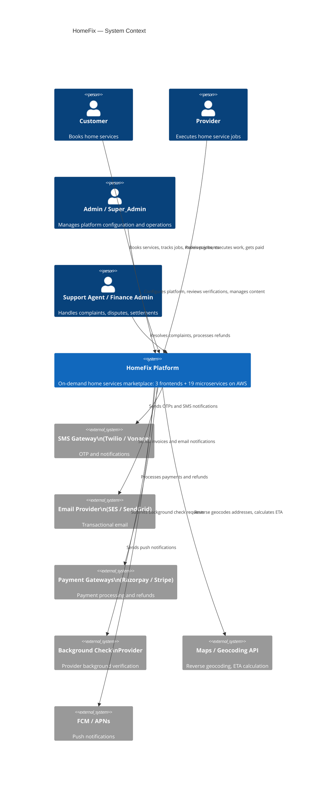
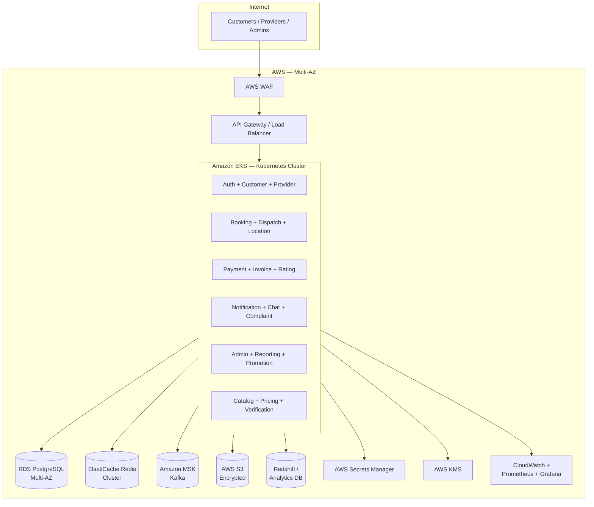
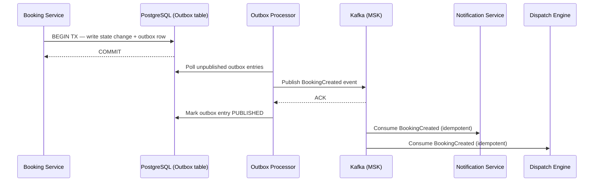

# Design Document — HomeFix Platform

## Overview

HomeFix is a production-ready, cloud-native on-demand home services marketplace delivered as a distributed system of 19 microservices on AWS. The platform connects homeowners (Customers) with verified, background-checked service professionals (Providers) for emergency and scheduled home-service engagements across categories such as plumbing, electrical, AC repair, carpentry, appliance repair, cleaning, painting, pest control, and locksmith services.

### Core Objectives

- **Safety**: Every Provider passes a multi-step document and background-check verification before accepting jobs.
- **Transparency**: Customers see a fully itemized price breakdown before confirming any booking.
- **Responsiveness**: Emergency bookings dispatch a Provider within seconds; real-time location tracking keeps Customers informed throughout.
- **Reliability**: The Saga pattern, transactional outbox, idempotent consumers, and dead-letter queues ensure no state change is lost even under partial failure.
- **Scalability**: Kubernetes HPA, event-driven architecture, and read-through caches allow the platform to scale horizontally with demand.

### User Roles

| Role | Description |
|---|---|
| Customer | Homeowner or tenant booking home services |
| Provider | Verified service professional fulfilling jobs |
| Dispatcher | Operations staff monitoring and intervening in dispatch |
| Admin | Platform administrator with configuration and oversight access |
| Super_Admin | Highest-privilege admin with full system configuration access |
| Support_Agent | Handles complaints, disputes, and user issues |
| Finance_Admin | Manages payment reconciliation, refunds, and financial reports |

### Frontend Applications

| Application | Stack | Layout |
|---|---|---|
| Customer App | React + TypeScript + Vite + TanStack Query + Zustand | Responsive / mobile-first |
| Provider App | Same stack | Mobile-first |
| Admin Portal | Same stack | Desktop-first |

---

## Architecture

### Architectural Style

The platform follows a **microservices architecture** with an **event-driven backbone** (Apache Kafka on AWS MSK). Services communicate synchronously via REST/HTTP for request-response interactions and asynchronously via Kafka events for cross-service state propagation. The Transactional Outbox pattern guarantees at-least-once Kafka delivery without distributed transactions.

### C4 Level 1 — System Context



### C4 Level 2 — Container View

```mermaid
C4Container
  title HomeFix — Container View

  Container(customer_app, "Customer App", "React + TypeScript + Vite", "Service discovery, booking, live tracking, payment, history")
  Container(provider_app, "Provider App", "React + TypeScript + Vite", "Job management, photo upload, earnings, verification status")
  Container(admin_app, "Admin App", "React + TypeScript + Vite", "Platform management, dispatch config, reports, audit logs")

  Container(api_gw, "API Gateway", "AWS API Gateway / Kong", "JWT validation, routing, rate limiting, WAF, HTTPS enforcement, X-Correlation-ID")

  Container(auth_svc, "Auth Service", "Spring Boot", "Registration, OTP, JWT issuance, refresh token rotation, RBAC, social login")
  Container(customer_svc, "Customer Service", "Spring Boot", "Profile, address management, GPS detection, PII encryption")
  Container(provider_svc, "Provider Service", "Spring Boot", "Provider profile, skills, availability, wallet, settlement")
  Container(verification_svc, "Verification Service", "Spring Boot", "Document upload, background check state machine, audit trail")
  Container(catalog_svc, "Service Catalog Service", "Spring Boot", "Service categories and subcategories, pricing attributes, caching")
  Container(pricing_svc, "Pricing Engine", "Spring Boot", "Itemized price calculation, multipliers, coupon validation, Admin config")
  Container(booking_svc, "Booking Service", "Spring Boot", "Booking creation, Saga orchestration, state machine, audit trail")
  Container(dispatch_svc, "Dispatch Engine", "Spring Boot", "Provider matching, scoring, job offers, exclusive locking, radius expansion")
  Container(location_svc, "Location Service", "Spring Boot", "Real-time location ingestion, ETA push, subscriber management")
  Container(payment_svc, "Payment Service", "Spring Boot", "Multi-gateway payments, idempotency, wallet credit, settlement transfers")
  Container(invoice_svc, "Invoice Service", "Spring Boot", "PDF generation, S3 storage, signed URL delivery, invoice numbering")
  Container(rating_svc, "Rating & Review Service", "Spring Boot", "Review submission, weighted aggregate recalculation, fraud detection")
  Container(complaint_svc, "Complaint Service", "Spring Boot", "Complaint lifecycle, SLA enforcement, refund coordination")
  Container(notification_svc, "Notification Service", "Spring Boot", "Multi-channel dispatch, delivery log, deduplication, retry")
  Container(chat_svc, "Chat Service", "Spring Boot", "WebSocket channels, message storage, channel lifecycle")
  Container(admin_svc, "Admin Service", "Spring Boot", "Dashboard, operational modules, RBAC enforcement, Audit_Log")
  Container(reporting_svc, "Reporting Service", "Spring Boot", "Pre-built reports, async generation, analytics data store")
  Container(promotion_svc, "Promotion / Coupon Service", "Spring Boot", "Coupon CRUD, atomic redemption, concurrent safety")

  ContainerDb(rds, "PostgreSQL (RDS)", "Per-service schema", "Primary transactional data stores")
  ContainerDb(redis, "Redis (ElastiCache)", "Cluster mode", "Session tokens, distributed locks, location cache, catalog cache")
  ContainerDb(s3, "AWS S3", "Server-side encrypted", "Documents, photos, invoices, media")
  Container(kafka, "Apache Kafka (MSK)", "Event streaming", "Cross-service events, outbox relay, DLQ")
  ContainerDb(analytics_db, "Analytics Store (Redshift / Aurora)", "Columnar", "Raw event data for reports, ad-hoc queries, 2-year retention")
```



### Microservice List (19 services)

| # | Service | Primary Responsibility |
|---|---|---|
| 1 | Auth Service | Authentication, JWT, RBAC |
| 2 | Customer Service | Customer profile, addresses |
| 3 | Provider Service | Provider profile, skills, wallet |
| 4 | Verification Service | Provider verification state machine |
| 5 | Service Catalog Service | Service categories and subcategories |
| 6 | Pricing Engine | Price calculation and configuration |
| 7 | Booking Service | Booking creation, state machine, Saga |
| 8 | Dispatch Engine | Provider matching and job offer dispatch |
| 9 | Location Service | Real-time location and ETA |
| 10 | Payment Service | Payment processing, refunds, wallet |
| 11 | Invoice Service | PDF invoice generation and delivery |
| 12 | Rating & Review Service | Ratings, reviews, fraud detection |
| 13 | Complaint Service | Complaints, SLA, dispute resolution |
| 14 | Notification Service | Multi-channel notification dispatch |
| 15 | Chat Service | In-app real-time chat |
| 16 | Admin Service | Admin dashboard and operations portal |
| 17 | Reporting Service | Reports and analytics |
| 18 | Promotion / Coupon Service | Coupon and promotion management |
| 19 | Outbox Processor | Transactional outbox relay to Kafka |

### AWS Infrastructure Topology



### Event-Driven Architecture

All significant state transitions publish events to Kafka topics. Consumers process events idempotently using persisted event IDs. The Transactional Outbox pattern guarantees no event is lost if a service restarts between committing a DB transaction and publishing to Kafka.



---

## Components and Interfaces

### Auth Service

**Responsibilities**: OTP registration flow, JWT issuance and refresh token rotation, social login (Google, Apple), RBAC enforcement, logout.

**Key APIs**:
- `POST /auth/register/otp` — send OTP
- `POST /auth/register/verify` — verify OTP, create account, return JWT + refresh token
- `POST /auth/login/social` — social login
- `POST /auth/token/refresh` — rotate refresh token
- `POST /auth/logout` — revoke refresh token
- `GET /auth/introspect` — validate JWT and return claims (used by API Gateway)

**Token Storage**: Refresh tokens stored in Redis (TTL = 30 days). Token family tracked for replay detection.

**RBAC**: Role claims embedded in JWT. API Gateway validates JWT signature; per-endpoint role checks performed within each service using a shared RBAC middleware.

### Booking Service

**Responsibilities**: Booking creation, state machine enforcement, Saga orchestration, cancellation fee logic, audit trail.

**State Machine (condensed)**:
```
CREATED → SEARCHING_PROVIDER → PROVIDER_ASSIGNED → PROVIDER_ACCEPTED
        → PROVIDER_ON_THE_WAY → PROVIDER_ARRIVED → JOB_STARTED
        → JOB_PAUSED ↔ JOB_STARTED
        → ADDITIONAL_QUOTE_REQUIRED → CUSTOMER_APPROVAL_PENDING
        → JOB_COMPLETED → CUSTOMER_CONFIRMED → PAYMENT_PENDING
        → PAYMENT_COMPLETED → REFUNDED
Terminal: SEARCHING_FAILED, CANCELLED, REFUNDED
```

**Saga Steps** (recorded before each progression):
1. Create Booking record
2. Request price estimate from Pricing Engine
3. Publish BookingCreated event to outbox
4. Await Provider acceptance (Dispatch Engine)
5. Collect job execution milestones
6. Trigger payment flow

**Audit Trail**: Every transition records `(booking_id, from_state, to_state, actor_id, actor_role, timestamp, reason)`.

### Dispatch Engine

**Responsibilities**: Provider matching, scoring, sequential job offer dispatch, exclusive locking, search radius expansion.

**Matching Score Formula**:
```
score = distanceScore×w₁ + availabilityScore×w₂ + ratingScore×w₃ + skillScore×w₄ + performanceScore×w₅
Default weights: w₁=0.30, w₂=0.25, w₃=0.20, w₄=0.15, w₅=0.10
```

**Exclusive Locking**: Before sending a job offer, the Dispatch Engine acquires a Redis lock keyed on `dispatch:lock:provider:{providerId}` with a TTL equal to the offer timeout (default 60 s). This prevents concurrent bookings from sending simultaneous offers to the same Provider.

**Radius Expansion**: Initial radius from Admin config (default 10 km). Expands by 5 km per cycle, maximum 3 expansion cycles.

### Pricing Engine

**Responsibilities**: Itemized price calculation, multiplier application, coupon validation, Admin-configurable parameters.

**Price Formula**:
```
total = base_price
      + distance_charge (≤ max_travel_charge)
      + time_charge
      + parts_materials_charge
      + emergency_charge  (base × emergency_multiplier, ≤ 2.0x)
      + weekend_surcharge
      + night_surcharge   (22:00–06:00 local time)
      + demand_surge_charge (≤ 2.0x)
      + platform_fee
      + applicable_taxes
      − discount_amount
      − coupon_amount
      (final total ≥ 0.01)
```

When both emergency and surge multipliers apply, emergency is applied first: `effective = base × emergency_multiplier × surge_multiplier`, capped at `emergency_cap + surge_cap`.

**Configuration Cache**: Admin pricing parameters cached in Redis with a TTL of 60 s; any Admin update invalidates and re-populates the cache within 60 s.

### Payment Service

**Responsibilities**: Multi-gateway abstraction, idempotency, transaction state machine, wallet credit, settlement bank transfer.

**Transaction State Machine**:
```
PENDING → SUCCESS → REFUNDED | PARTIALLY_REFUNDED
PENDING → FAILED (terminal)
```

**Idempotency Key**: Scoped to `(customerId, bookingId)`. Stored in Redis with TTL sufficient to cover the payment window. Duplicate requests return the original transaction status.

**Gateway Abstraction**: `PaymentGatewayPort` interface with implementations for each gateway (e.g., `RazorpayGatewayAdapter`, `StripeGatewayAdapter`). Adding a new gateway requires only a new adapter — no core logic changes.

### Location Service

**Responsibilities**: Ingest Provider location updates (max 1/5 s per Provider per Booking), cache last known location in Redis, push updates and ETA to subscribed Customers via WebSocket/SSE.

**Data Flow**:
1. Provider submits `POST /locations/{bookingId}` with GPS coordinates.
2. Location Service writes to Redis (`location:{bookingId}:{providerId}`) and persists to PostgreSQL for dispute resolution.
3. Location Service calculates ETA using Maps API and pushes `{coordinates, eta}` to all WebSocket subscribers for that Booking.
4. On `JOB_STARTED` event, Location Service terminates all active subscriptions and stops accepting updates for that Booking.

### Notification Service

**Responsibilities**: Multi-channel dispatch (push, SMS, email, in-app), delivery deduplication, retry, preference enforcement.

**Deduplication Key**: `(kafkaEventId, channel)` stored in the delivery log. Any redelivery of the same event to the same channel is silently discarded.

**Retry Policy**: Up to 3 retries with exponential backoff at 1 s, 2 s, 4 s.

**Vendor Abstraction**: `SmsPort` and `EmailPort` interfaces allow swapping vendors without touching notification business logic.

### Chat Service

**Responsibilities**: WebSocket channel management, message delivery (<1 s under 500 concurrent channels), 90-day message retention, channel lifecycle tied to Booking state.

**Channel Access Control**: Each channel record stores `(bookingId, customerId, providerId)`. Any message send or read request is validated against this record; non-participants receive `403 Forbidden`.

### Verification Service

**Responsibilities**: Enforce Provider verification state machine, document storage, background check integration, audit trail.

**State Machine**:
```
PENDING → DOCUMENT_SUBMITTED → DOCUMENT_VERIFIED → BACKGROUND_CHECK_PENDING
        → BACKGROUND_CHECK_COMPLETED → APPROVED → SUSPENDED → APPROVED
                                     → REJECTED
```

Terminal-eligible states: `APPROVED`, `REJECTED`, `SUSPENDED`.

### Rating & Review Service

**Responsibilities**: Review submission, weighted aggregate recalculation, fraud detection, Admin moderation.

**Weighted Rating Formula**:
```
aggregate = (sum of recent_reviews × 1.5 + sum of older_reviews × 1.0)
           / (count_recent × 1.5 + count_older × 1.0)
rounded to 2 decimal places
```

**Fraud Detection Triggers**:
1. ≥2 reviews from the same IP address within 1 hour
2. Star rating deviates > 2 SD from Provider's historical mean
3. Reviewer account created within 24 hours of submission

Flagged reviews are held pending Admin approval and excluded from the aggregate until approved.

---

## Data Models

### Core Entity Relationships

```mermaid
erDiagram
  USER {
    uuid id PK
    string mobile_number
    string email
    string[] roles
    string status
    timestamp created_at
  }

  CUSTOMER_PROFILE {
    uuid id PK
    uuid user_id FK
    string display_name
    string email_encrypted
    string photo_url
    timestamp updated_at
  }

  ADDRESS {
    uuid id PK
    uuid customer_id FK
    string label
    float lat
    float lng
    text address_text_encrypted
    boolean is_default
    boolean is_active
  }

  PROVIDER_PROFILE {
    uuid id PK
    uuid user_id FK
    string display_name
    int years_experience
    int service_radius_km
    float aggregate_rating
    decimal wallet_balance
    string verification_status
    boolean emergency_available
    string bank_account_encrypted
  }

  SERVICE_CATEGORY {
    uuid id PK
    string name
    string description
    string icon_url
    int display_order
    boolean is_active
  }

  SERVICE_SUBCATEGORY {
    uuid id PK
    uuid category_id FK
    string name
    decimal base_price
    int estimated_duration_min
    string[] skill_tags
    boolean emergency_available
    boolean is_active
  }

  BOOKING {
    uuid id PK
    uuid customer_id FK
    uuid provider_id FK
    uuid subcategory_id FK
    uuid address_id FK
    string status
    boolean is_emergency
    decimal estimated_total
    decimal final_total
    timestamp created_at
    timestamp started_at
    timestamp completed_at
    int net_duration_seconds
    string saga_state
  }

  BOOKING_AUDIT {
    uuid id PK
    uuid booking_id FK
    string from_state
    string to_state
    uuid actor_id
    string actor_role
    timestamp transitioned_at
    text reason
  }

  JOB_MEDIA {
    uuid id PK
    uuid booking_id FK
    string type
    string s3_key
    timestamp uploaded_at
  }

  PRICE_BREAKDOWN {
    uuid id PK
    uuid booking_id FK
    decimal base_price
    decimal distance_charge
    decimal time_charge
    decimal parts_charge
    decimal emergency_charge
    decimal weekend_surcharge
    decimal night_surcharge
    decimal surge_charge
    decimal platform_fee
    decimal taxes
    decimal discount_amount
    decimal coupon_amount
    decimal total
  }

  PAYMENT_TRANSACTION {
    uuid id PK
    uuid booking_id FK
    uuid customer_id FK
    string idempotency_key
    string gateway
    string method
    string status
    decimal amount
    decimal refunded_amount
    string gateway_ref
    timestamp created_at
  }

  PROVIDER_EARNINGS {
    uuid id PK
    uuid provider_id FK
    uuid booking_id FK
    decimal gross
    decimal platform_fee
    decimal net
    string status
    timestamp credited_at
  }

  SETTLEMENT {
    uuid id PK
    uuid provider_id FK
    decimal amount
    string status
    string bank_account_ref_encrypted
    timestamp requested_at
    timestamp completed_at
  }

  INVOICE {
    uuid id PK
    uuid booking_id FK
    uuid payment_id FK
    string invoice_number
    string s3_key
    timestamp generated_at
  }

  REVIEW {
    uuid id PK
    uuid booking_id FK
    uuid reviewer_id FK
    uuid reviewee_id FK
    string reviewer_role
    int overall_rating
    int behavior_rating
    int quality_rating
    int timeliness_rating
    int pricing_transparency_rating
    text review_text
    boolean is_flagged
    boolean is_active
    timestamp submitted_at
    timestamp expires_at
  }

  COMPLAINT {
    uuid id PK
    uuid booking_id FK
    uuid customer_id FK
    uuid agent_id FK
    string category
    text description
    string status
    timestamp created_at
    timestamp resolved_at
    timestamp sla_deadline
  }

  NOTIFICATION_LOG {
    uuid id PK
    string kafka_event_id
    string channel
    uuid user_id FK
    string status
    int retry_count
    text error_description
    timestamp dispatched_at
  }

  CHAT_MESSAGE {
    uuid id PK
    uuid channel_id FK
    uuid sender_id FK
    text content
    timestamp sent_at
    boolean is_delivered
  }

  CHAT_CHANNEL {
    uuid id PK
    uuid booking_id FK
    uuid customer_id FK
    uuid provider_id FK
    boolean is_active
    timestamp activated_at
    timestamp deactivated_at
  }

  COUPON {
    uuid id PK
    string code
    string discount_type
    decimal discount_value
    decimal min_order_value
    decimal max_discount_cap
    date valid_from
    date expiry_date
    int per_user_limit
    int total_limit
    int total_used
    boolean is_active
  }

  OUTBOX_EVENT {
    uuid id PK
    string aggregate_type
    uuid aggregate_id
    string event_type
    jsonb payload
    string status
    timestamp created_at
    timestamp published_at
  }

  AUDIT_LOG {
    uuid id PK
    uuid actor_id FK
    string action_type
    string entity_type
    uuid entity_id
    jsonb before_values
    jsonb after_values
    timestamp logged_at
  }

  USER ||--o{ CUSTOMER_PROFILE : "has"
  USER ||--o{ PROVIDER_PROFILE : "has"
  CUSTOMER_PROFILE ||--o{ ADDRESS : "has"
  PROVIDER_PROFILE ||--o{ PROVIDER_EARNINGS : "earns"
  PROVIDER_PROFILE ||--o{ SETTLEMENT : "requests"
  SERVICE_CATEGORY ||--o{ SERVICE_SUBCATEGORY : "contains"
  BOOKING }o--|| CUSTOMER_PROFILE : "placed by"
  BOOKING }o--o| PROVIDER_PROFILE : "assigned to"
  BOOKING }o--|| SERVICE_SUBCATEGORY : "for"
  BOOKING }o--|| ADDRESS : "at"
  BOOKING ||--o{ BOOKING_AUDIT : "has"
  BOOKING ||--o| PRICE_BREAKDOWN : "priced as"
  BOOKING ||--o{ JOB_MEDIA : "has"
  BOOKING ||--o{ PAYMENT_TRANSACTION : "paid via"
  BOOKING ||--o| INVOICE : "invoiced as"
  BOOKING ||--o{ REVIEW : "reviewed via"
  BOOKING ||--o{ COMPLAINT : "disputed via"
  BOOKING ||--o| CHAT_CHANNEL : "chatted via"
  CHAT_CHANNEL ||--o{ CHAT_MESSAGE : "contains"
```



### Key Schema Decisions

**Per-service database isolation**: Each microservice owns its own PostgreSQL schema (or RDS instance for high-traffic services like Booking and Payment). Cross-service data access is strictly via API calls — no shared tables.

**PII encryption**: `email_encrypted`, `address_text_encrypted`, `bank_account_encrypted` fields store AES-256 encrypted values via KMS. Decryption only occurs within the owning service under authorized service-account credentials.

**Audit Log immutability**: The `audit_log` table is append-only, stored in a tamper-evident data store with write access restricted to service accounts. No human user account holds direct write access.

**Outbox pattern**: The `outbox_event` table is written within the same database transaction as the state change. A dedicated Outbox Processor polls unpublished rows, publishes to Kafka, and marks them as published upon broker ACK.

**Idempotency tokens**: `payment_transaction.idempotency_key` is a unique index on `(customer_id, booking_id)`. Duplicate payment attempts return the existing transaction without re-processing.

---

## Correctness Properties

*A property is a characteristic or behavior that should hold true across all valid executions of a system — essentially, a formal statement about what the system should do. Properties serve as the bridge between human-readable specifications and machine-verifiable correctness guarantees.*

### Property 1: Pricing formula non-negativity

*For any* valid combination of booking inputs, pricing parameters, multipliers, surcharges, platform fee, taxes, discounts, and coupon amounts, the Pricing Engine SHALL produce a final total that is greater than or equal to 0.01.

**Validates: Requirements 6.1**

---

### Property 2: Emergency multiplier cap

*For any* emergency booking, the emergency charge applied by the Pricing Engine SHALL NOT cause the emergency multiplier factor to exceed the configured maximum emergency multiplier cap (default 2.0×).

**Validates: Requirements 6.2**

---

### Property 3: Surge multiplier cap

*For any* booking under surge demand conditions, the surge multiplier applied by the Pricing Engine SHALL NOT exceed the configured maximum surge multiplier cap (default 2.0×).

**Validates: Requirements 6.3**

---

### Property 4: Combined multiplier cap

*For any* booking to which both the emergency multiplier and the surge multiplier apply, the Pricing Engine SHALL apply the emergency multiplier first and then the surge multiplier, and the combined effective multiplier SHALL NOT exceed the sum of the two configured caps.

**Validates: Requirements 6.4**

---

### Property 5: Distance charge cap

*For any* valid provider–customer distance and per-km rate, the distance charge computed by the Pricing Engine SHALL NOT exceed the configured maximum travel charge.

**Validates: Requirements 6.7**

---

### Property 6: Itemized price breakdown completeness

*For any* booking, the price breakdown returned by the Pricing Engine SHALL contain a non-null entry for every defined price component (base price, emergency charge, surge charge, night surcharge, weekend surcharge, distance charge, parts/materials, platform fee, taxes, discounts, coupon amount), and the sum of all components SHALL equal the returned total.

**Validates: Requirements 6.9**

---

### Property 7: Provider-specific price override bounds

*For any* provider-specific pricing override, the Pricing Engine SHALL reject the override if and only if the proposed price is below the platform-defined floor or above the platform-defined ceiling for the Service_Subcategory.

**Validates: Requirements 6.12**

---

### Property 8: Booking state machine valid transitions only

*For any* booking in any state, the Booking Service SHALL permit a state transition if and only if the target state appears in the defined permitted transitions map for the current source state; any other transition SHALL be rejected with a 409 Conflict response.

**Validates: Requirements 9.1, 9.2**

---

### Property 9: Booking audit trail completeness

*For any* state transition that is successfully applied to a booking, the Booking Service SHALL record exactly one audit entry containing the booking ID, from_state, to_state, actor ID, actor role, and a timestamp, and the sequence of audit entries SHALL form a contiguous chain of transitions from CREATED to the current state.

**Validates: Requirements 9.15**

---

### Property 10: Job duration calculation correctness

*For any* completed booking with an arbitrary sequence of JOB_STARTED and JOB_PAUSED intervals, the net job duration stored on the booking record SHALL equal the sum of all JOB_STARTED interval durations minus the sum of all JOB_PAUSED interval durations.

**Validates: Requirements 11.6**

---

### Property 11: Payment idempotency

*For any* payment attempt using a given (customerId, bookingId) idempotency key, if a prior attempt with the same key has been recorded, the Payment Service SHALL return the status of the original transaction and SHALL NOT create a new transaction record or initiate a new gateway charge.

**Validates: Requirements 12.3**

---

### Property 12: Payment transaction state machine valid transitions only

*For any* payment transaction in any state, the Payment Service SHALL permit a transition if and only if the target state appears in the defined permitted transitions map (PENDING → SUCCESS | FAILED; SUCCESS → REFUNDED | PARTIALLY_REFUNDED); any other transition SHALL be rejected.

**Validates: Requirements 12.4**

---

### Property 13: Provider wallet credit on payment success

*For any* booking whose payment transitions to SUCCESS, the Provider's wallet balance SHALL increase by exactly (payment_amount − platform_fee_amount) within 60 seconds of the PaymentCompleted event.

**Validates: Requirements 12.10**

---

### Property 14: Invoice number uniqueness and format

*For any* set of generated invoices, no two invoices SHALL share the same invoice number, and every invoice number SHALL match the format INV-YYYY-MM-NNNNNN where NNNNNN is a monotonically increasing sequence per month.

**Validates: Requirements 13.4**

---

### Property 15: Review window enforcement

*For any* review submission, the Rating & Review Service SHALL accept the submission if and only if the current timestamp is before the review prompt expiry (PAYMENT_COMPLETED timestamp + 7 calendar days); any submission after expiry SHALL be rejected.

**Validates: Requirements 15.1, 15.2**

---

### Property 16: Weighted aggregate rating correctness

*For any* provider with an arbitrary set of reviews partitioned into recent (≤90 days) and older (>90 days), the aggregate rating computed by the Rating & Review Service SHALL equal the weighted average applying a 1.5× multiplier to recent reviews and 1.0× to older reviews, rounded to 2 decimal places.

**Validates: Requirements 15.4**

---

### Property 17: Flagged reviews excluded from aggregate

*For any* review that has been flagged and not yet approved by an Admin, the Rating & Review Service SHALL NOT include that review's ratings in the Provider's aggregate score calculation.

**Validates: Requirements 15.5**

---

### Property 18: Dispatch matching score formula

*For any* set of eligible Providers for a given booking and any Admin-configured weight set that sums to 1.0, the Dispatch Engine SHALL compute each Provider's matching score as exactly the weighted sum of the five scoring components using the configured weights.

**Validates: Requirements 8.3, 8.4**

---

### Property 19: Dispatch weight validation

*For any* Admin-submitted dispatch weight update, the Dispatch Engine SHALL accept the update if and only if every individual weight is in the range [0.0, 1.0] and all weights sum to exactly 1.0; otherwise the update SHALL be rejected and the existing weights SHALL remain unchanged.

**Validates: Requirements 19.5**

---

### Property 20: Coupon usage counter atomicity

*For any* concurrently arriving coupon redemption requests for the same coupon code, the Promotion/Coupon Service SHALL ensure the total usage counter and per-user usage counter never exceed their configured limits, regardless of the number of concurrent requests.

**Validates: Requirements 21.3**

---

### Property 21: Coupon cancellation counter decrement

*For any* booking that used a coupon and is subsequently cancelled before payment is captured, the Promotion/Coupon Service SHALL atomically decrement both the total usage counter and the per-user usage counter to their pre-redemption values.

**Validates: Requirements 21.5**

---

### Property 22: Notification delivery deduplication

*For any* Kafka event redelivered to the Notification Service that has already been processed for a given channel, the Notification Service SHALL NOT dispatch a duplicate notification to the user for that channel.

**Validates: Requirements 17.7, 22.5**

---

### Property 23: Chat channel access restriction

*For any* message send or read request targeting a chat channel, the Chat Service SHALL permit the operation if and only if the requesting user is either the Customer or the Provider linked to the booking that owns the channel; any other user SHALL receive a 403 Forbidden response.

**Validates: Requirements 18.7**

---

### Property 24: Verification state machine valid transitions only

*For any* verification status transition request, the Verification Service SHALL permit the transition if and only if the target state appears in the defined permitted transitions map for the current source state; any other transition SHALL be rejected with an error identifying the current state and the disallowed target state.

**Validates: Requirements 5.1, 5.2**

---

### Property 25: OTP session lockout

*For any* OTP session, if 5 or more consecutive incorrect OTP submissions are made, the Auth Service SHALL lock that session for exactly 30 minutes and no further OTP verification attempts SHALL succeed during that window.

**Validates: Requirements 1.3**

---

### Property 26: Refresh token replay detection and family invalidation

*For any* refresh token that has already been used once (replay), the Auth Service SHALL invalidate the entire token family for that user such that no token in the family can produce a new access token.

**Validates: Requirements 1.10**

---

### Property 27: Rate limiting correctness

*For any* user with the CUSTOMER role, the API Gateway SHALL permit requests up to the rate limit (100 requests/minute) and SHALL reject all subsequent requests within the same rate window with a 429 Too Many Requests response containing a Retry-After header.

**Validates: Requirements 23.3, 23.5**

---

## Error Handling

### Principles

1. **Fail fast with descriptive errors**: Every validation failure returns an HTTP 4xx response with a structured error body containing `errorCode`, `message`, and optional `details` (field-level violations).
2. **Never expose internals**: 5xx responses and WAF blocks return generic error bodies with a correlation ID only; stack traces and internal system details are logged but never sent to clients.
3. **Idempotency on retries**: Payment, event publishing, and notification dispatch are all idempotent so client or infrastructure retries are safe.
4. **Circuit breakers prevent cascade**: Every synchronous inter-service call is wrapped in a Resilience4j circuit breaker configured at 50% failure rate / 10-call sliding window / 30 s open wait. When open, a fallback response signals degradation to the caller.
5. **Dead-letter queues for unrecoverable events**: After 3 consumer retry attempts (5 s between each), the event is published to the consumer group's dead-letter topic and processing continues. Operations teams are alerted for manual intervention.
6. **Saga compensating transactions**: If any step in the Booking Saga fails after earlier steps have committed, compensating transactions execute in reverse order within 30 seconds, and the caller receives a booking-not-completed response.

### Error Response Schema

```json
{
  "errorCode": "BOOKING_STATE_INVALID_TRANSITION",
  "message": "Transition from JOB_STARTED to CREATED is not permitted.",
  "details": {
    "currentState": "JOB_STARTED",
    "requestedState": "CREATED",
    "bookingId": "b1234567-..."
  },
  "correlationId": "a9f3c8d1-..."
}
```

### Specific Error Scenarios

| Scenario | HTTP Status | Handling |
|---|---|---|
| Invalid JWT | 401 | API Gateway rejects before routing |
| Expired/revoked refresh token | 401 | Auth Service returns 401; client must re-authenticate |
| Refresh token replay | 401 | Auth Service invalidates entire token family |
| Insufficient role | 403 | Service or API Gateway returns 403 |
| Rate limit exceeded | 429 | API Gateway returns 429 + Retry-After |
| Invalid booking state transition | 409 | Booking Service returns 409 + audit log entry |
| Invalid verification state transition | 409 | Verification Service returns 409 |
| Pricing Engine unavailable | 503 | Booking Service returns 503; no booking created |
| Payment gateway callback invalid signature | 400 | Payment Service rejects + logs incident |
| Provider not APPROVED | 403 | Verification Service rejects job assignment |
| Coupon constraint violated | 422 | Promotion Service returns 422 + violated constraint |
| OTP session locked | 429 | Auth Service returns 429 + lockout duration |
| Address in use by active Booking | 409 | Customer Service returns 409 |

---

## Testing Strategy

### Dual Testing Approach

The HomeFix platform employs a **dual testing approach** combining example-based unit tests and property-based tests, complemented by integration and contract tests.

**Unit Tests** — cover specific scenarios, edge cases, integration points, and error conditions:
- State machine transition tables (both valid and invalid transitions)
- Pricing formula with boundary inputs (zero coupon, maximum multiplier, minimum total = 0.01)
- OTP flow happy path, lockout, expiry, replay scenarios
- Refresh token rotation and replay detection
- Invoice number format and sequential uniqueness
- Notification preference filtering
- Chat channel access control (participant vs. non-participant)

**Property-Based Tests** — verify universal properties across generated inputs:
- Library: **jqwik** (Java) for Spring Boot microservices
- Each property test runs a **minimum of 100 iterations**
- Each test is tagged with: `Feature: homefix-platform, Property {N}: {property_text}`

**Integration Tests**:
- End-to-end booking flow (scheduled and emergency) against staging environment
- Payment gateway callback processing with signature verification
- Kafka event publication and idempotent consumption
- Outbox processor relay under failure injection
- Verification state machine with document upload
- Circuit breaker open/half-open/closed transitions

**Contract Tests** (Pact):
- Consumer-driven contracts between Booking Service and: Dispatch Engine, Pricing Engine, Notification Service
- Ensures schema compatibility as services evolve independently

**Observability Tests**:
- Health endpoints (`/health/liveness`, `/health/readiness`) return correct HTTP codes
- Prometheus metrics endpoint exposes required metric names
- Structured log output contains all mandatory fields

### Property-Based Test Configuration

Each property-based test in `jqwik` references its design document property using an `@Label` annotation:

```java
@Property(tries = 100)
@Label("Feature: homefix-platform, Property 1: Pricing formula non-negativity")
void pricingTotalNeverBelowMinimum(
    @ForAll @Positive BigDecimal basePrice,
    @ForAll @DoubleRange(min = 1.0, max = 2.0) double emergencyMultiplier,
    @ForAll @DoubleRange(min = 1.0, max = 2.0) double surgeMultiplier,
    @ForAll @BigRange(min = "0.00", max = "999.99") BigDecimal discount
) {
    PricingResult result = pricingEngine.calculate(buildInput(basePrice, emergencyMultiplier, surgeMultiplier, discount));
    assertThat(result.getTotal()).isGreaterThanOrEqualTo(new BigDecimal("0.01"));
}
```

### Test Coverage Targets

| Layer | Coverage Target |
|---|---|
| Unit (service logic) | ≥ 80% line coverage |
| Property (core engines) | 100% of defined correctness properties |
| Integration (booking flows) | All happy paths + critical failure scenarios |
| Contract | All inter-service synchronous APIs |
