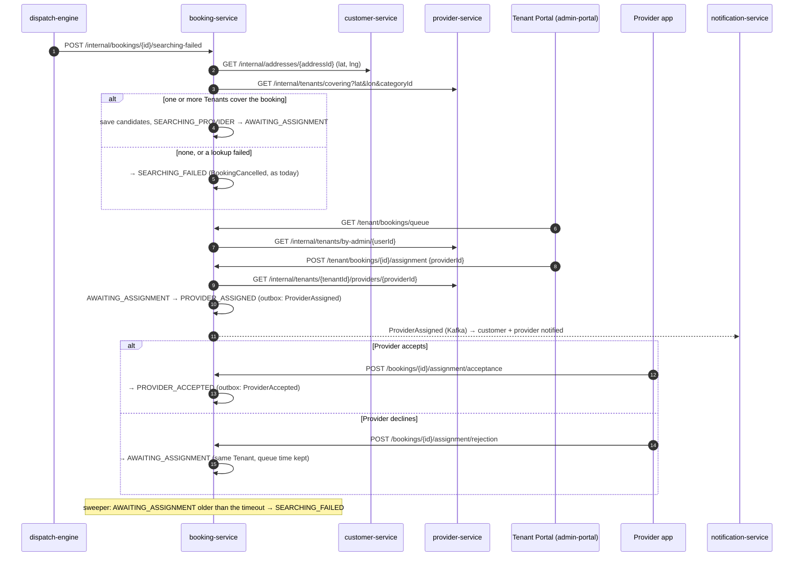
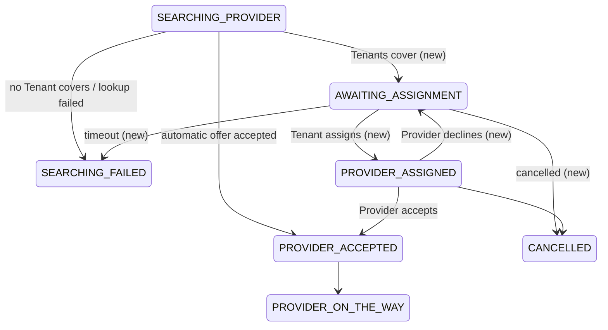
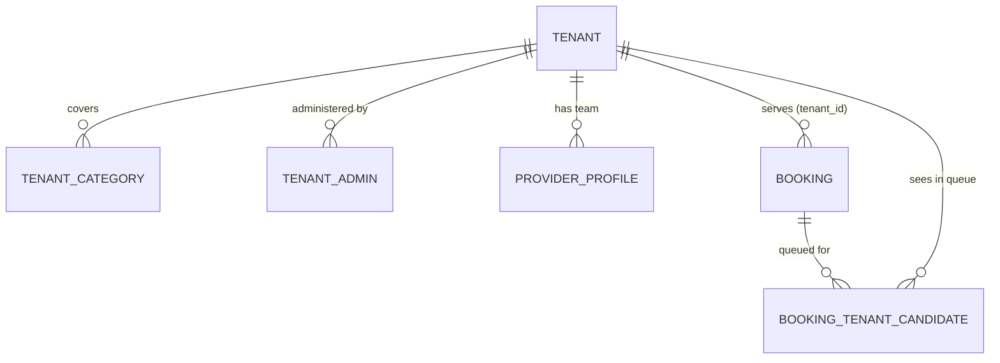

# Design Document — Multi-Tenant Agencies and Mobile Apps

## Overview

This design implements [requirements.md](requirements.md). It adds Tenants (service agencies) to the one
HomeFix marketplace and routes bookings that automatic matching could not place to the Tenants covering
them, where a Tenant_Admin assigns one of the Tenant's Providers. It also completes the Android and iOS
builds of the customer and provider apps.

The design deliberately reuses what exists:

- the unused `PROVIDER_ASSIGNED` booking state and its `ProviderAssigned` event, which the Notification
  Service already consumes (customer and provider templates exist);
- the internal service credential (`X-Internal-Api-Key`) and the internal-endpoint pattern used by
  dispatch, payment and verification;
- the Admin Portal application, which gains a Tenant-scoped mode instead of a fourth web app;
- the Capacitor setup already in both apps (Capacitor 7, Android projects, `frontend/MOBILE.md`, and the
  native-build URL guard in `src/config/env.ts`, which already satisfies Requirement 14.2).

No new microservice is introduced.

### Key decisions

| # | Decision | Alternatives considered | Why |
|---|---|---|---|
| D1 | Tenants live in **provider-service** | A new tenant-service | A Tenant is an organisation of Providers; membership, eligibility and availability data are already there. A new service adds a database schema, deployment, gateway routes and CI for little gain. |
| D2 | The caller's Tenant is resolved by **lookup** (`/internal/tenants/by-admin/{userId}`), not a JWT claim | Add a `tenantId` claim to tokens | A claim needs the shared security library, the gateway introspection and every token holder to change, and goes stale when an admin is moved. Tenant endpoints are low-volume; a short cache makes the lookup cheap. |
| D3 | Fallback is decided by **booking-service** when dispatch reports failure | Dispatch decides | booking-service already owns the `searching-failed` transition and has the address lookup (`CustomerAddressPort`) and the catalog category; dispatch stays unchanged. |
| D4 | The queue is visible to **all Candidate_Tenants**; first assignment wins | Route to the single nearest Tenant, then cascade | Simple, fair to agencies, no cascade timers; optimistic locking on the booking settles races. |
| D5 | Candidate Tenants are **snapshotted** in `booking_tenant_candidate` at queue time | Re-evaluate coverage on every queue read | booking-service stores no coordinates; a snapshot makes the queue a cheap indexed query and keeps a booking in a queue even if a Tenant later edits its area. |
| D6 | The assigned Provider must **confirm** (`PROVIDER_ASSIGNED → PROVIDER_ACCEPTED`) | Tenant assignment is final | Matches the existing state machine and keeps the Provider's consent, as with automatic offers. |
| D7 | Native apps via **Capacitor** from the same code | React Native / Flutter rewrite | Product-owner decision; one codebase for web, Android and iOS. |

---

## Architecture

### Fallback and assignment flow



### Booking state machine (changes in bold)



Today the Dispatch Engine passes through `PROVIDER_ASSIGNED` on the way to `PROVIDER_ACCEPTED`
(`transitionPassingThrough`); that path is unchanged.

---

## Components and Interfaces

All new internal endpoints are guarded by each service's existing `InternalApiKeyFilter` and are not routed by
the gateway. All new user-facing endpoints get RBAC rules in the service's `*RbacConfig` (unmapped paths are
open to any authenticated user). Errors use each service's existing envelope `{errorCode, message, …}`.

### auth-service

- `Role.TENANT_ADMIN` (not self-assignable). Migration `V3__tenant_admin_role.sql` widens the
  `user_account_role_role_check` constraint.
- Internal endpoints, for provider-service only:
  - `GET /internal/users/by-mobile?mobileNumber=+91…` → `{userId, roles[], status}`; 404 `USER_NOT_FOUND`.
  - `POST /internal/users/{userId}/roles/TENANT_ADMIN` → grant (idempotent).
  - `DELETE /internal/users/{userId}/roles/TENANT_ADMIN` → revoke (idempotent); also revokes the user's
    refresh-token families so the role disappears immediately.
  - Only `TENANT_ADMIN` may be granted or revoked through these endpoints (400 otherwise).
- Tokens issued at login and refresh read roles from the account (verify refresh does; Requirement 2.5).

### provider-service (owns Tenants — D1)

**Data** (migration `V3__tenants.sql`):

```sql
CREATE TABLE provider.tenant (
  id uuid PRIMARY KEY, name varchar(120) NOT NULL, status varchar(16) NOT NULL DEFAULT 'ACTIVE'
    CHECK (status IN ('ACTIVE','SUSPENDED')),
  contact_phone varchar(20), contact_email varchar(254),
  base_latitude double precision NOT NULL, base_longitude double precision NOT NULL,
  service_radius_km numeric(5,1) NOT NULL CHECK (service_radius_km BETWEEN 1 AND 100),
  created_at timestamptz NOT NULL, updated_at timestamptz NOT NULL, updated_by uuid,
  version bigint NOT NULL);
CREATE TABLE provider.tenant_category (tenant_id uuid REFERENCES provider.tenant(id),
  category_id uuid NOT NULL, PRIMARY KEY (tenant_id, category_id));
CREATE TABLE provider.tenant_admin (tenant_id uuid NOT NULL REFERENCES provider.tenant(id),
  user_id uuid PRIMARY KEY);                       -- one Tenant per admin (Req 2.3)
ALTER TABLE provider.provider_profile ADD COLUMN tenant_id uuid REFERENCES provider.tenant(id);
CREATE INDEX idx_provider_profile_tenant ON provider.provider_profile (tenant_id);
```

**Platform admin endpoints** (`ADMIN`, `SUPER_ADMIN`), gateway route `/admin/tenants/**`:

| Method & path | Body | Response |
|---|---|---|
| `GET /admin/tenants` | — | `Tenant[]` (below) |
| `POST /admin/tenants` | `{name, contactPhone?, contactEmail?, baseLatitude, baseLongitude, serviceRadiusKm, categoryIds[]}` | 201 `Tenant` |
| `PUT /admin/tenants/{id}` | same + `status` | `Tenant` |
| `GET /admin/tenants/{id}/members` | — | `{admins:[{userId, mobileNumber}], providers:[TeamProvider]}` |
| `POST /admin/tenants/{id}/admins` | `{mobileNumber}` | 201 `{userId, mobileNumber}` |
| `DELETE /admin/tenants/{id}/admins/{userId}` | — | 204 |
| `POST /admin/tenants/{id}/providers` | `{mobileNumber}` | 201 `TeamProvider` |
| `DELETE /admin/tenants/{id}/providers/{providerId}` | — | 204 |

`Tenant = {id, name, status, contactPhone, contactEmail, baseLatitude, baseLongitude, serviceRadiusKm,
categoryIds[], providerCount, adminCount, createdAt, updatedAt}`.
Category ids are validated against the catalog (provider-service already has a catalog client).
`updated_by` records the last Platform_Admin to change a Tenant; every Tenant, administrator and membership
change is also logged at INFO with the actor id, Tenant id and change (no personal data), as auth-service does
for account status changes. (The admin audit log belongs to admin-service and has no cross-service write
path; a shared audit trail is out of scope.)

**Tenant admin endpoints** (`TENANT_ADMIN`; Tenant resolved from the JWT subject through `tenant_admin`),
gateway route `/tenant/me`, `/tenant/providers/**`:

| Method & path | Response |
|---|---|
| `GET /tenant/me` | `Tenant` |
| `GET /tenant/providers` | `TeamProvider[]` |
| `POST /tenant/providers {mobileNumber}` | 201 `TeamProvider` |
| `DELETE /tenant/providers/{providerId}` | 204 |

`TeamProvider = {providerId, displayName, mobileNumber, primarySkill, verificationStatus, rating,
availableNow, assignable}`. `availableNow` reuses `EligibilityEvaluator.availabilityScore`;
`verificationStatus` uses the existing batch call to verification-service. A `SUSPENDED` Tenant's admins get
403 `TENANT_SUSPENDED`.

**Internal endpoints** (booking-service is the caller):

| Method & path | Response |
|---|---|
| `GET /internal/tenants/covering?lat&lon&categoryId` | `{tenants:[{tenantId, name, distanceKm}]}`, nearest first, `ACTIVE` only (Req 1.4) |
| `GET /internal/tenants/by-admin/{userId}` | `{tenantId, name, status}`; 404 when not an admin |
| `GET /internal/tenants/{tenantId}/providers/{providerId}` | `{member, assignable, verificationStatus}`; 404 when not a member |
| `GET /internal/tenants/of-provider/{providerId}` | `{tenantId, name}`; 404 when independent |
| `GET /internal/tenants/{tenantId}` | `{tenantId, name, status}`; 404 when unknown (for the booking detail's `tenantName`) |

Coverage uses the existing haversine helper (`GeoMath`) against each Tenant's base location and radius.

### booking-service

**Data** (migration `V3__tenant_assignment.sql`):

```sql
ALTER TABLE booking.booking DROP CONSTRAINT booking_status_check;
ALTER TABLE booking.booking ADD CONSTRAINT booking_status_check CHECK (status IN (…existing…, 'AWAITING_ASSIGNMENT'));
-- the audit table's from/to state checks are widened the same way
ALTER TABLE booking.booking ADD COLUMN tenant_id uuid, ADD COLUMN queued_for_assignment_at timestamptz;
CREATE TABLE booking.booking_tenant_candidate (booking_id uuid REFERENCES booking.booking(id),
  tenant_id uuid NOT NULL, PRIMARY KEY (booking_id, tenant_id));
CREATE INDEX idx_booking_tenant_candidate_tenant ON booking.booking_tenant_candidate (tenant_id);
CREATE INDEX idx_booking_tenant_created ON booking.booking (tenant_id, created_at DESC) WHERE tenant_id IS NOT NULL;
CREATE INDEX idx_booking_awaiting ON booking.booking (queued_for_assignment_at) WHERE status = 'AWAITING_ASSIGNMENT';
```

**State machine**: the transitions of Requirement 9.1 are added to `BookingStatus` / `BookingStateMachine`.
Cancellation fee policy treats `AWAITING_ASSIGNMENT` and `PROVIDER_ASSIGNED` as fee-free (Req 9.3).

**Fallback** (`DispatchOutcomeService.markSearchingFailed`, reached by `POST /internal/bookings/{id}/searching-failed`):

1. Resolve the address coordinates through `CustomerAddressPort` and call `TenantDirectoryPort.covering`.
2. If tenants are found: insert candidates, set `queued_for_assignment_at = now`, transition to
   `AWAITING_ASSIGNMENT` (actor `Actor.system()`, reason "no provider accepted; routed to N partner(s)").
   No `BookingCancelled` is written.
3. Otherwise, or if either lookup fails: `SEARCHING_FAILED` as today (Req 4.3, 4.4).

**Tenant endpoints** (`TENANT_ADMIN`), gateway route `/tenant/bookings/**`:

| Method & path | Response |
|---|---|
| `GET /tenant/bookings/queue` | `TenantBooking[]`, oldest queued first |
| `GET /tenant/bookings?status=` | `TenantBooking[]` where `tenant_id` = caller's Tenant, newest first, ≤ 200 |
| `POST /tenant/bookings/{key}/assignment {providerId}` | 200 `TenantBooking` |

`TenantBooking = {id, reference, serviceName, status, isEmergency, scheduledAt, createdAt, queuedAt, amount,
currency, address, coordinates, providerId}`; address and coordinates come from `CustomerAddressPort`.
The caller's Tenant is resolved through `TenantDirectoryPort.byAdmin` and cached for 60 s (D2).

Assignment, in one transaction with the booking's optimistic lock: booking is `AWAITING_ASSIGNMENT`; the
caller's Tenant is a candidate, or the booking's `tenant_id` after a decline; the Provider is `assignable` for
that Tenant (internal check); then `tenant_id`, `provider_id`, `PROVIDER_ASSIGNED`, and the outbox
`ProviderAssigned` event (the existing lifecycle publisher already writes it for this transition).
`ProviderAssignedEvent` gains two nullable fields, `tenantId` and `tenantName`, set for Tenant assignments. A
lost optimistic lock or a booking that moved on answers 409 `BOOKING_NOT_ASSIGNABLE` (Req 5.4).

**Provider confirmation** (assigned Provider only, through `BookingAccess.requireForProvider`):

- `POST /bookings/{key}/assignment/acceptance` → `PROVIDER_ACCEPTED`, and the outbox `ProviderAccepted`
  event with the Dispatch Engine's payload `{bookingId, customerId, providerId, bookingCreatedAt, acceptedAt}`
  so chat and notifications run unchanged (Req 6.1). This closes the dual-write noted in review 17.5 for
  this path, since the event is written in the booking transaction.
- `POST /bookings/{key}/assignment/rejection` → `AWAITING_ASSIGNMENT`, `provider_id = null`; `tenant_id` and
  `queued_for_assignment_at` are kept (Req 6.2, 7.2).

**Tenant on automatic acceptance**: `POST /internal/bookings/{id}/provider-accepted` looks up
`/internal/tenants/of-provider/{providerId}` and sets `tenant_id`; a failed lookup is logged and ignored
(Req 8.1, 8.2).

**Sweeper**: `@Scheduled` every 60 s; selects `AWAITING_ASSIGNMENT` bookings whose
`queued_for_assignment_at` is older than `homefix.booking.tenant-assignment-timeout` (default `PT60M`) and
transitions each to `SEARCHING_FAILED` through the transition service; the optimistic lock makes concurrent
instances safe (Req 7.3).

**Customer detail**: `BookingDetailResponse` gains `tenantName` when a Tenant is set (looked up only for
`PROVIDER_ASSIGNED`, to tell the Provider and Customer who assigned the job).

### dispatch-engine

No behaviour change. Its "searching failed" notifications to the customer and dispatcher team are sent only
when booking-service actually fails the booking: booking-service already answers the `searching-failed` call
with the booking (`BookingResponse`, including `status`); dispatch reads that body and skips its no-provider
notices when `status` is `AWAITING_ASSIGNMENT`.

### notification-service

`ProviderAssigned` is already consumed and has customer and provider templates; the provider template reads
"assigned to you by <tenantName>" when the event's new `tenantName` field is present. Templates now live in the
`notification_template` table (review 17.3), so the change is a new migration updating the seeded rows plus
the built-in fallback text, and `{{tenantName}}` becomes an allowed placeholder for that event. No new topics.

### api-gateway

New routes, placed before the `/admin/**` catch-all: `/admin/tenants/**` → provider-service;
`/tenant/bookings/**` → booking-service; `/tenant/**` → provider-service.

### Admin Portal (Tenant Portal + Tenants module)

- `STAFF_ROLES` gains `TENANT_ADMIN`. A `TENANT_ADMIN` sees only: **Requests** (landing; queue polled every
  15 s with a count badge; assign dialog listing `GET /tenant/providers` with availability and assignability),
  **Team** (list, add by mobile, remove), **Jobs** (`GET /tenant/bookings` with status filter).
- Platform admins get a **Tenants** module: list, create/edit (categories from `/admin/catalog/categories`,
  base location as latitude/longitude with radius), members (admins and providers, add by mobile, remove).
- Guards follow the RBAC tiers; a `TENANT_ADMIN` never sees platform modules.

### Customer app and provider app

- Customer: `progress.ts` maps `AWAITING_ASSIGNMENT` to the searching phase with partner copy and
  `PROVIDER_ASSIGNED` to an "assigned, confirming" phase; status chips and history labels follow.
- Provider: `PROVIDER_ASSIGNED` jobs show "Assigned by <tenantName>" with **Accept** and **Decline**; the job
  detail polls while assigned; Accept continues into the existing active-job flow.

### Mobile (Capacitor)

| Item | Design |
|---|---|
| Platforms | Add `ios/` to customer-app and provider-app with `npx cap add ios` (Capacitor 7). Android projects exist. |
| Location | Provider app uses `@capacitor/geolocation` when `env.isNative`, falling back to `navigator.geolocation` on the web; the same `useShareLocation` hook wraps both. |
| Camera / photos | File inputs work in the native WebView; add `@capacitor/camera` only if the in-app capture UX requires it. Declare permissions either way. |
| iOS permissions | `Info.plist`: `NSLocationWhenInUseUsageDescription` (provider), `NSCameraUsageDescription`, `NSPhotoLibraryUsageDescription` (both apps). |
| Android permissions | Provider: location (present), camera; Customer: camera. |
| Config | Existing `VITE_API_BASE_URL` / `VITE_AUTH_BASE_URL` with the existing native guard; scripts `mobile:sync:ios`, `mobile:open:ios` in each `package.json`. |
| Docs | `frontend/MOBILE.md` gains iOS (macOS + Xcode + Apple developer account; simulator and device; local backend via the machine's LAN address and cleartext/ATS notes) and the new plugins. |

iOS projects can be generated on Windows but built and signed only on macOS; CI for native builds is out of
scope.

---

## Data Models



`TENANT`, `TENANT_CATEGORY`, `TENANT_ADMIN` and `PROVIDER_PROFILE.tenant_id` live in the `provider` schema;
`BOOKING.tenant_id` and `BOOKING_TENANT_CANDIDATE` in the `booking` schema. Cross-schema ids are not foreign
keys (each service owns its schema).

---

## Security

| Endpoint group | Roles | Additional rule |
|---|---|---|
| `/admin/tenants/**` | ADMIN, SUPER_ADMIN | — |
| `/tenant/**` (both services) | TENANT_ADMIN | Tenant resolved from the subject; other Tenants' resources answer 404; suspended Tenant → 403 |
| `/bookings/{key}/assignment/*` | any authenticated | assigned Provider only (404 otherwise) |
| `/internal/tenants/**`, `/internal/users/**` | service credential | not routed by the gateway |

Tenant_Admins do not gain access to customer personal data beyond what a Provider sees for an assigned job:
the service address and coordinates of bookings in their queue or Tenant.

---

## Error Codes

| Code | HTTP | Where |
|---|---|---|
| `TENANT_NOT_FOUND` | 404 | provider-service |
| `TENANT_SUSPENDED` | 403 | provider-service, booking-service |
| `USER_NOT_FOUND` | 404 | provider-service (add admin) |
| `ADMIN_OF_OTHER_TENANT` | 409 | provider-service |
| `PROVIDER_NOT_FOUND` | 404 | provider-service (add provider) |
| `PROVIDER_IN_OTHER_TENANT` | 409 | provider-service |
| `BOOKING_NOT_ASSIGNABLE` | 409 | booking-service |
| `PROVIDER_NOT_ASSIGNABLE` | 409 | booking-service |

---

## Correctness Properties

### Property MT1: Fallback only when nobody accepted

*For any* booking, the Booking Service SHALL enter `AWAITING_ASSIGNMENT` only from `SEARCHING_PROVIDER`, only
after the Dispatch Engine reported that no Provider accepted, and only when at least one `ACTIVE` Tenant
covered the booking at that moment.

**Validates: Requirements 4.1–4.4, 9.1**

### Property MT2: Coverage is geometric and categorical

*For any* Tenant and booking, the Tenant SHALL be a Candidate_Tenant if and only if the haversine distance from
the Tenant's base location to the service address is at most the Tenant's radius, the booking's category is
one of the Tenant's categories, and the Tenant is `ACTIVE`.

**Validates: Requirements 1.4, 4.2**

### Property MT3: One assignment wins

*For any* set of concurrent assignment requests for one booking, at most one SHALL succeed; every other SHALL
receive 409 and leave the booking as the winner left it.

**Validates: Requirement 5.4**

### Property MT4: A Tenant assigns only its own approved Providers

*For any* successful assignment, the assigned Provider SHALL be a member of the assigning Tenant with
verification status `APPROVED` at the time of assignment.

**Validates: Requirements 5.2, 5.5**

### Property MT5: Tenant isolation

*For any* Tenant_Admin request, every booking, Provider and Tenant returned SHALL belong to the caller's Tenant
or be in the caller's Assignment_Queue; no request parameter SHALL widen this scope.

**Validates: Requirements 10.1, 10.2**

### Property MT6: Queue timeout is monotonic

*For any* booking that entered `AWAITING_ASSIGNMENT` at time t, the booking SHALL be `SEARCHING_FAILED` no later
than t + timeout + sweep interval unless it was assigned and accepted or cancelled first; Provider declines
SHALL NOT extend this bound.

**Validates: Requirements 7.1, 7.2**

### Property MT7: Assigned acceptance is indistinguishable downstream

*For any* booking accepted through a Tenant assignment, the `ProviderAccepted` event SHALL carry the same
fields as one published by the Dispatch Engine, so consumers cannot tell the two paths apart.

**Validates: Requirement 6.1**

### Property MT8: Membership uniqueness

*For any* Provider, at most one Tenant SHALL list it as a member; *for any* user, at most one Tenant SHALL list
it as an administrator.

**Validates: Requirements 2.3, 3.1**

---

## Testing Strategy

- **Unit / web-layer** per service, following each module's conventions (MockMvc through the real security
  chain for new controllers, in-memory fakes for repositories, stub HTTP servers for new adapters).
- **Concurrency**: assignment race with two transactions against H2 or Testcontainers PostgreSQL (MT3);
  sweeper idempotence across two instances (MT6).
- **Property-style tests** for coverage (MT2) with generated coordinates around the radius boundary.
- **End to end** (`docker/verify-outbox-flow.sh`): a booking with the demo Tenant's providers made unavailable
  for automatic matching falls back, appears in the Tenant queue, is assigned, declined, reassigned, accepted,
  run and paid; plus isolation checks with a second Tenant.
- **Apps**: typecheck, lint, build; screenshots of the Tenant Portal and the new app states; Android build
  where the SDK is available; iOS project generation verified (build on macOS).

## Rollout and Migration

1. Deploy auth-service and provider-service migrations first (additive).
2. Deploy booking-service with the state migration; until a Tenant exists, `covering` returns none and
   behaviour is identical to today.
3. Deploy dispatch-engine, gateway routes and the apps.
4. Seed or create Tenants; nothing changes for customers until a booking falls back.

## Open Questions

1. Should a Tenant earn a commission on jobs its Providers complete (payout split between Tenant and
   Provider)? Out of scope here; Provider earnings are unchanged.
2. Should Tenant_Admins be notified by push or SMS when a request lands in their queue, in addition to the
   portal badge?
3. Should Tenants be able to accept bookings *before* automatic matching (premium or exclusive coverage)?

---

## As built (2026-10-03)

Where the implementation differs from this design, or settles something the design left open. Each point
was checked against the code on 2026-10-03; requirement-level changes are also recorded inline in
[requirements.md](requirements.md) under *As built*.

**Booking lifecycle**

- **Sweeper also fails unanswered assignments.** `AssignmentTimeoutSweeper` selects bookings in
  `AWAITING_ASSIGNMENT` *or* `PROVIDER_ASSIGNED` whose `queued_for_assignment_at` is older than
  `homefix.booking.tenant-assignment-timeout` (`TENANT_ASSIGNMENT_TIMEOUT`, default `PT60M`), at most 100
  per pass, each in its own transaction. A `PROVIDER_ASSIGNED` booking is passed through
  `AWAITING_ASSIGNMENT` (audited "did not confirm before the assignment deadline") and then failed, so no new
  state-machine edge was needed. The Provider stays on the booking, so the cancellation notice reaches
  them. Property MT6 already describes this bound; the sweeper paragraph and the sequence-diagram note
  above describe the narrower original. (Requirement 7.1.)
- **Only the assigned Provider answers an assignment.** `ProviderAssignmentService` checks
  `booking.providerId == caller` itself instead of using `BookingAccess.requireForProvider`, which admits
  staff; staff get the same 404 as anyone else. A repeated acceptance is a no-op. (Requirement 6.3.)
- **Optimistic-lock conflicts** anywhere in booking-service now answer 409 `BOOKING_CHANGED` (they used to
  surface as 500), for example a Provider accepting at the moment the sweeper expires the booking.

**Errors added to the table above**

| Code | HTTP | Where |
|---|---|---|
| `BOOKING_CHANGED` | 409 | booking-service, any command that loses an optimistic-lock race |
| `TENANT_DIRECTORY_UNAVAILABLE` | 503 | booking-service Tenant endpoints when provider-service cannot be asked |
| `TENANT_NOT_FOUND` | 404 | also booking-service, and provider-service `/tenant/**`: a `TENANT_ADMIN` who administers no Tenant |
| `AUTH_UNAVAILABLE` | 503 | provider-service add/remove admin, add provider, when auth-service cannot be reached (no change made) |
| `TENANT_CONCURRENTLY_MODIFIED` | 409 | provider-service `PUT /admin/tenants/{id}` losing to a concurrent edit |
| `ROLE_NOT_MANAGEABLE` | 400 | auth-service internal role endpoints, any role other than `TENANT_ADMIN` |
| `INVALID_TENANT_NAME`, `INVALID_CONTACT_PHONE`, `INVALID_CONTACT_EMAIL`, `INVALID_LATITUDE`, `INVALID_LONGITUDE`, `INVALID_SERVICE_RADIUS`, `CATEGORIES_REQUIRED`, `INACTIVE_CATEGORY`, `INVALID_TENANT_STATUS` | 400 | provider-service Tenant validation (Requirement 1.2) |

**Data and payloads**

- **V3 booking index.** `idx_booking_awaiting` (on `queued_for_assignment_at WHERE status =
  'AWAITING_ASSIGNMENT'`) was replaced by `idx_booking_assignment_deadline` on `(status,
  queued_for_assignment_at) WHERE queued_for_assignment_at IS NOT NULL`: the sweeper reads two statuses, and
  an `IS NOT NULL` predicate is implied by `queued_for_assignment_at < $1` even under a generic plan, which a
  status list is not.
- **`TeamProvider.mobileNumber` is `null` in lists** (`GET /tenant/providers`, the providers in
  `GET /admin/tenants/{id}/members`). The number lives in auth-service and one lookup per member was not
  worth it; it is set only in the response to adding a provider. Administrators in the members list do
  carry their number.
- **Category validation is not enforced.** provider-service's `CatalogClientPort` has only
  `StubCatalogClientAdapter`, which treats every non-null id as active, so `INACTIVE_CATEGORY` cannot fire
  yet; the design's "provider-service already has a catalog client" refers to this stub. An HTTP adapter is
  the follow-up. (Requirement 1.2.)

**Configuration**

- booking-service selects its `TenantDirectoryPort` with `homefix.booking.tenant-directory-client`
  (`TENANT_DIRECTORY_CLIENT`): `http` (default) calls provider-service's `/internal/tenants/**`; `stub` knows
  no Tenants, which disables the fallback (an unplaced booking fails exactly as before) and makes every
  booking-service Tenant endpoint answer 404 `TENANT_NOT_FOUND`. The HTTP adapter never degrades a failure to an empty
  answer: the fallback logs it and fails the booking (Requirement 4.4), Tenant endpoints answer 503.

**Accounts and tokens**

- **Revoking `TENANT_ADMIN`** removes the membership, revokes the role and ends the user's refresh-token
  families. Access tokens already issued are stateless and keep the role until they expire (access TTL,
  15 minutes), so "the role disappears immediately" above is not literally true. The Tenant endpoints
  still refuse quickly because they check membership, not the role alone: provider-service at once
  (404 `TENANT_NOT_FOUND`), booking-service once its 60 s by-admin cache entry expires.
- **`TENANT_ADMIN` is not staff for the user-status rule** in auth-service's User Management: an `ADMIN` may
  suspend or reactivate a Tenant_Admin (only a `SUPER_ADMIN` may change `ADMIN`/`SUPER_ADMIN` accounts).

**Apps and mobile**

- Admin Portal, customer app and provider app match the design. The Tenants module takes categories from
  `/admin/catalog/categories`; the provider app polls an assigned job every 5 s and the Tenant queue polls
  every 15 s.
- Mobile differs from the table above in detail: the customer app declares location too (Android
  permissions and `NSLocationWhenInUseUsageDescription`) for "use my current location" on the address form;
  both apps declare camera (Android `CAMERA`, optional `android.hardware.camera`) and the iOS camera and
  photo-library strings. `@capacitor/camera` was not added: the native apps show an extra file input with
  `capture="environment"` ("Take photo") and the web apps are unchanged. The provider app uses
  `@capacitor/geolocation` 7.x natively and `navigator.geolocation` on the web.
- **Native builds are not verified.** Web build, `npx cap sync` for both platforms, typecheck and lint pass;
  no Gradle or Xcode build has run, because the development machine has no Android SDK, only JDK 25
  (Gradle 8.11.1 needs 17 or 21) and no macOS. `ios/` is not committed yet and `Podfile.lock` will appear
  with the first `pod install` on a Mac. See `frontend/MOBILE.md`.
