# HomeFix — Architecture and Diagrams

**Audience:** engineers joining the platform, and anyone reviewing its design.
**Companion documents:** [API_CONTRACTS.md](API_CONTRACTS.md) for JSON payloads, [LOCAL_ACCESS.md](LOCAL_ACCESS.md) for test users and URLs, [../CODEBASE_REVIEW.md](../CODEBASE_REVIEW.md) for the findings audit.

Diagrams are Mermaid and render natively on GitHub. Where a diagram shows an integration that is currently broken in code, the break is marked and cross-referenced to the review.

---

## 1. System context

HomeFix is an on-demand home-services marketplace. Customers book verified providers for scheduled or emergency jobs (plumbing, electrical, AC, cleaning). Providers are onboarded through document verification and a background check, then matched to jobs by a dispatch engine.

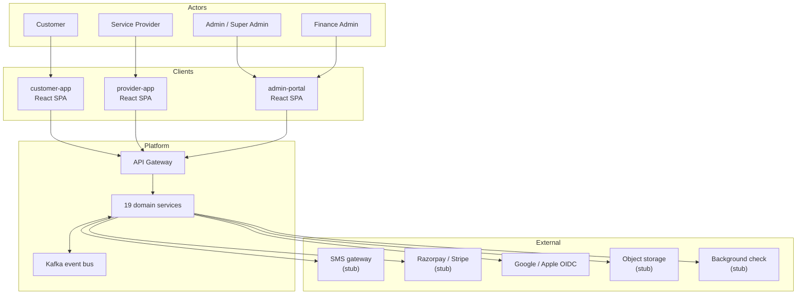
```mermaid
graph TB
    subgraph Actors
        C["Customer"]
        P["Service Provider"]
        A["Admin / Super Admin"]
        F["Finance Admin"]
    end

    subgraph Clients
        CA["customer-app<br/>React SPA"]
        PA["provider-app<br/>React SPA"]
        AP["admin-portal<br/>React SPA"]
    end

    subgraph Platform
        GW["API Gateway"]
        SVC["19 domain services"]
        BUS["Kafka event bus"]
    end

    subgraph External
        SMS["SMS gateway<br/>(stub)"]
        PAY["Razorpay / Stripe<br/>(stub)"]
        OIDC["Google / Apple OIDC"]
        S3["Object storage<br/>(stub)"]
        KYC["Background check<br/>(stub)"]
    end

    C --> CA
    P --> PA
    A --> AP
    F --> AP
    CA --> GW
    PA --> GW
    AP --> GW
    GW --> SVC
    SVC <--> BUS
    SVC --> SMS
    SVC --> PAY
    SVC --> OIDC
    SVC --> S3
    SVC --> KYC
```

Every external integration except Google and Apple OIDC is currently a logging or in-memory stub. See review section 10, item 2. Locally, payments are settled by a payment simulator that only Compose enables (section 5.5).

---

## 2. Container diagram

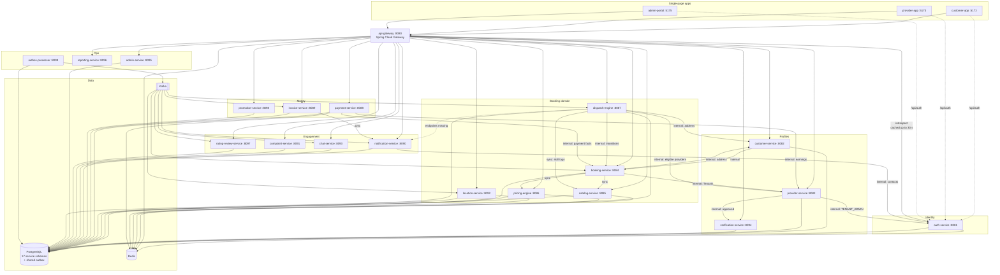
```mermaid
graph TB
    subgraph SPAs["Single-page apps"]
        CA["customer-app :5173"]
        PA["provider-app :5174"]
        AP["admin-portal :5175"]
    end

    GW["api-gateway :8080<br/>Spring Cloud Gateway"]

    subgraph Identity
        AUTH["auth-service :8081"]
    end

    subgraph Profiles
        CUST["customer-service :8082"]
        PROV["provider-service :8083"]
        VER["verification-service :8094"]
    end

    subgraph Booking["Booking domain"]
        BOOK["booking-service :8084"]
        CAT["catalog-service :8085"]
        PRICE["pricing-engine :8086"]
        DISP["dispatch-engine :8087"]
        LOC["location-service :8092"]
    end

    subgraph Money
        PAYS["payment-service :8088"]
        INV["invoice-service :8089"]
        PROMO["promotion-service :8098"]
    end

    subgraph Engagement
        NOTIF["notification-service :8090"]
        CHAT["chat-service :8093"]
        CMPL["complaint-service :8091"]
        RATE["rating-review-service :8097"]
    end

    subgraph Ops
        ADM["admin-service :8095"]
        REP["reporting-service :8096"]
        OUT["outbox-processor :8099"]
    end

    subgraph Data
        PG[("PostgreSQL<br/>17 service schemas<br/>+ shared outbox")]
        RD[("Redis")]
        KF[["Kafka"]]
    end

    CA --> GW
    PA --> GW
    AP --> GW
    CA -.->|"/api/auth"| AUTH
    PA -.->|"/api/auth"| AUTH
    AP -.->|"/api/auth"| AUTH

    GW -->|introspect<br/>cached up to 30 s| AUTH
    GW --> CUST & PROV & VER & BOOK & CAT & PRICE & DISP & LOC
    GW --> PAYS & INV & PROMO & NOTIF & CHAT & CMPL & RATE & ADM & REP

    BOOK -->|sync| PRICE
    BOOK -->|sync| CAT
    BOOK -->|"internal: address"| CUST
    BOOK -->|"internal: Tenants"| PROV
    DISP -->|"internal: eligible providers"| PROV
    DISP -->|"internal: address"| CUST
    DISP -->|"sync: skill tags"| CAT
    DISP -.->|"endpoints missing"| NOTIF
    DISP -->|"internal: transitions"| BOOK
    PAYS -->|"internal: payment facts"| BOOK
    PAYS -->|"internal: earnings"| PROV
    PROV -->|"internal: approved"| VER
    PROV -->|"internal: TENANT_ADMIN"| AUTH
    NOTIF -->|"internal: contacts"| AUTH
    CUST -->|internal| BOOK
    INV -->|sync| NOTIF

    AUTH & CUST & PROV & VER & BOOK & CAT & PRICE & DISP & PAYS & INV & PROMO & NOTIF & CHAT & CMPL & RATE & ADM & LOC --> PG
    AUTH & GW & CAT & PRICE & DISP & LOC & PAYS --> RD
    OUT --> PG
    OUT --> KF
    KF --> BOOK & DISP & NOTIF & INV & CHAT & RATE & LOC
```

Arrows labelled `internal` go to `/internal/**` endpoints. They carry no end-user token: the caller acts on its own behalf and presents the shared service credential (`X-Internal-Api-Key`) instead. Dispatch's calls to notification-service (`/internal/notifications/**`) still answer 4xx because notification-service has no such endpoints; they are best effort, and providers see offers by polling dispatch instead.

Note that the SPAs talk to auth-service directly for the registration and refresh endpoints, bypassing the gateway. The nginx and Vite configs proxy `/api/auth` to port 8081 and everything else under `/api` to the gateway.

---

## 3. Request path through the gateway

Every authenticated call crosses two filter chains: the reactive chain in the gateway, then the servlet chain inside the target service.

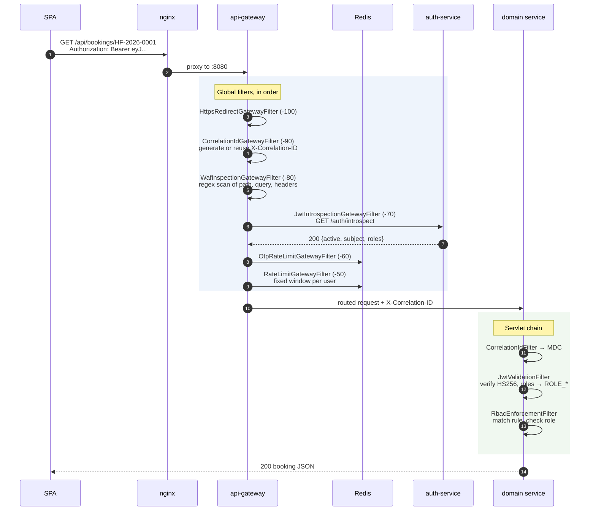
```mermaid
sequenceDiagram
    autonumber
    participant SPA as SPA
    participant NGX as nginx
    participant GW as api-gateway
    participant RD as Redis
    participant AUTH as auth-service
    participant SVC as domain service

    SPA->>NGX: GET /api/bookings/HF-2026-0001<br/>Authorization: Bearer eyJ...
    NGX->>GW: proxy to :8080

    rect rgb(238, 244, 252)
    note over GW: Global filters, in order
    GW->>GW: HttpsRedirectGatewayFilter (-100)
    GW->>GW: CorrelationIdGatewayFilter (-90)<br/>generate or reuse X-Correlation-ID
    GW->>GW: WafInspectionGatewayFilter (-80)<br/>regex scan of path, query, headers
    GW->>AUTH: JwtIntrospectionGatewayFilter (-70)<br/>GET /auth/introspect
    AUTH-->>GW: 200 {active, subject, roles}
    GW->>RD: OtpRateLimitGatewayFilter (-60)
    GW->>RD: RateLimitGatewayFilter (-50)<br/>fixed window per user
    end

    GW->>SVC: routed request + X-Correlation-ID

    rect rgb(240, 248, 240)
    note over SVC: Servlet chain
    SVC->>SVC: CorrelationIdFilter → MDC
    SVC->>SVC: JwtValidationFilter<br/>verify HS256, roles → ROLE_*
    SVC->>SVC: RbacEnforcementFilter<br/>match rule, check role
    end

    SVC-->>SPA: 200 booking JSON
```

The gateway's introspection call has a response timeout (3 s by default) and resolves auth-service through the JDK resolver so a recreated container is followed (review 14.1). Active results are reused for at most `homefix.gateway.auth.introspection-cache.ttl` (30 s by default) and never past the token's `exp`, keyed by a SHA-256 of the token and bounded to 10,000 entries; inactive results and failed calls are never cached, so an auth-service outage still denies. Concurrent requests carrying the same uncached token share one call. The cost is revocation latency: if access tokens ever become revocable before `exp`, the gateway honours a revocation within the ttl. Today logout revokes only the refresh token, so nothing is lost. Set the ttl to `0` to introspect every request.

The role filter used to be the larger problem. It passes through when no rule matches, and until recently no service except admin and reporting configured any rule, so every staff endpoint accepted any valid token. Every service behind the gateway except the outbox relay (18 of them) now registers rules, including one for every Admin Portal and Tenant Portal path. Public paths are still deliberately left unruled, because this filter runs inside the security chain and a rule on a public path would turn it into a 401. Rules are matched against the decoded path within the application, without the servlet context path, with one trailing slash removed and case ignored, rather than against the raw request URI. A `GET` rule also governs `HEAD`. Anything Spring Security's `StrictHttpFirewall` refuses, such as `;` path parameters, encoded `/`, `\`, `.` or `%`, `//`, `/./` or `/../`, is answered with 400 before any rule is evaluated. Before this change, `/admin;x/users`, `/%61dmin/users` and `HEAD /admin/users` each reached the admin handler without a role check. See review sections 8.2 and 12.1.

---

## 4. End-to-end customer journey

```mermaid
flowchart TD
    START(["Customer opens app"]) --> OTP["Enter mobile number"]
    OTP --> VERIFY{"OTP correct?"}
    VERIFY -->|"5 wrong attempts"| LOCK["Locked 30 min"]
    VERIFY -->|yes| HOME["Browse catalog"]

    HOME --> PICK["Pick subcategory"]
    PICK --> MODE{"Emergency?"}

    MODE -->|no| SCHED["Choose slot<br/>min lead time enforced"]
    MODE -->|yes| EST
    SCHED --> EST["Price estimate<br/>pricing-engine"]

    EST --> COUPON{"Apply coupon?"}
    COUPON -->|yes| VAL["Validate with<br/>promotion-service"]
    COUPON -->|no| CREATE
    VAL --> CREATE["Create booking"]

    CREATE --> SEARCH["SEARCHING_PROVIDER<br/>dispatch-engine matches"]
    SEARCH --> OFFER{"Provider accepts<br/>within window?"}
    OFFER -->|"no, all exhausted"| EXPAND["Expand radius"]
    EXPAND --> OFFER
    OFFER -->|"no candidates left"| TENANT{"A Tenant covers<br/>area + category?"}
    TENANT -->|no| FAILED["SEARCHING_FAILED"]
    TENANT -->|yes| QUEUE["AWAITING_ASSIGNMENT<br/>Tenant admin assigns"]
    QUEUE -->|"deadline, 60 min"| FAILED
    QUEUE --> ASSIGNED{"Assigned provider<br/>accepts?"}
    ASSIGNED -->|declines| QUEUE
    ASSIGNED -->|yes| ACCEPTED
    OFFER -->|yes| ACCEPTED["PROVIDER_ACCEPTED"]

    ACCEPTED --> TRACK["On the way: live tracking"]
    TRACK --> ARRIVE["Provider arrives<br/>before photos"]
    ARRIVE --> WORK["Job in progress"]
    WORK --> PARTS{"Extra parts needed?"}
    PARTS -->|yes| QUOTE["Customer approves quote<br/>60 min auto-resolve"]
    PARTS -->|no| DONE
    QUOTE --> DONE["After photos, complete"]

    DONE --> PAY["Customer pays<br/>(this is the confirmation)"]
    PAY --> INVOICE["Invoice PDF issued"]
    INVOICE --> REVIEW["Review prompt, 7 days"]
    REVIEW --> HAPPY{"Satisfied?"}
    HAPPY -->|no| CMPL["Raise complaint<br/>SLA clock starts"]
    HAPPY -->|yes| END(["Done"])
    CMPL --> REFUND{"Refund approved?"}
    REFUND -->|yes| END
    REFUND -->|no| ESC["Escalate / dispute"]
```

---

## 5. Sequence diagrams

### 5.1 OTP registration and token issue

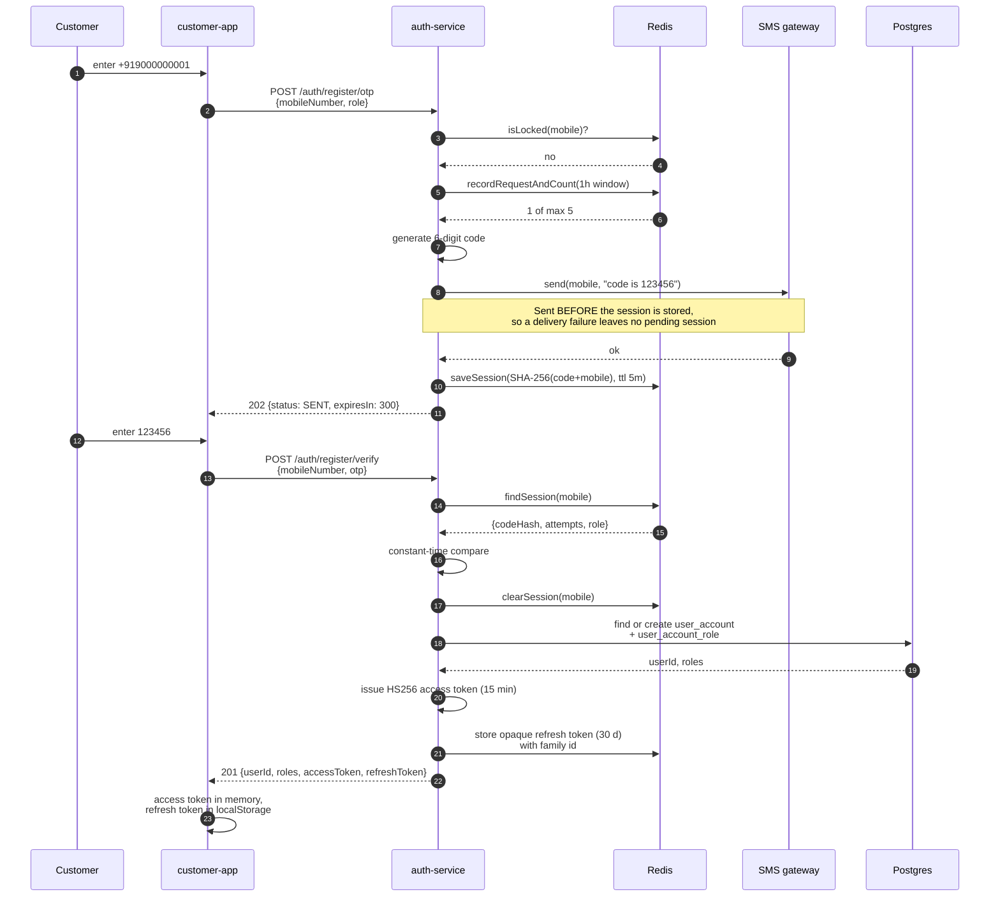
```mermaid
sequenceDiagram
    autonumber
    participant U as Customer
    participant APP as customer-app
    participant AUTH as auth-service
    participant RD as Redis
    participant SMS as SMS gateway
    participant PG as Postgres

    U->>APP: enter +919000000001
    APP->>AUTH: POST /auth/register/otp<br/>{mobileNumber, role}
    AUTH->>RD: isLocked(mobile)?
    RD-->>AUTH: no
    AUTH->>RD: recordRequestAndCount(1h window)
    RD-->>AUTH: 1 of max 5
    AUTH->>AUTH: generate 6-digit code
    AUTH->>SMS: send(mobile, "code is 123456")
    note over AUTH,SMS: Sent BEFORE the session is stored,<br/>so a delivery failure leaves no pending session
    SMS-->>AUTH: ok
    AUTH->>RD: saveSession(SHA-256(code+mobile), ttl 5m)
    AUTH-->>APP: 202 {status: SENT, expiresIn: 300}

    U->>APP: enter 123456
    APP->>AUTH: POST /auth/register/verify<br/>{mobileNumber, otp}
    AUTH->>RD: findSession(mobile)
    RD-->>AUTH: {codeHash, attempts, role}
    AUTH->>AUTH: constant-time compare
    AUTH->>RD: clearSession(mobile)
    AUTH->>PG: find or create user_account<br/>+ user_account_role
    PG-->>AUTH: userId, roles
    AUTH->>AUTH: issue HS256 access token (15 min)
    AUTH->>RD: store opaque refresh token (30 d)<br/>with family id
    AUTH-->>APP: 201 {userId, roles, accessToken, refreshToken}
    APP->>APP: access token in memory,<br/>refresh token in localStorage
```

On a wrong code the attempt counter increments and the session locks for 30 minutes at 5 attempts. `role` comes from the request body but only `CUSTOMER` and `SERVICE_PROVIDER` are accepted (anything else is 400 `INVALID_ROLE`); staff and `TENANT_ADMIN` roles are granted out of band. A `SUSPENDED` or `DEACTIVATED` account (`user_account.status`) cannot sign in or refresh, and introspection reports its tokens inactive.

### 5.2 Token refresh with replay detection

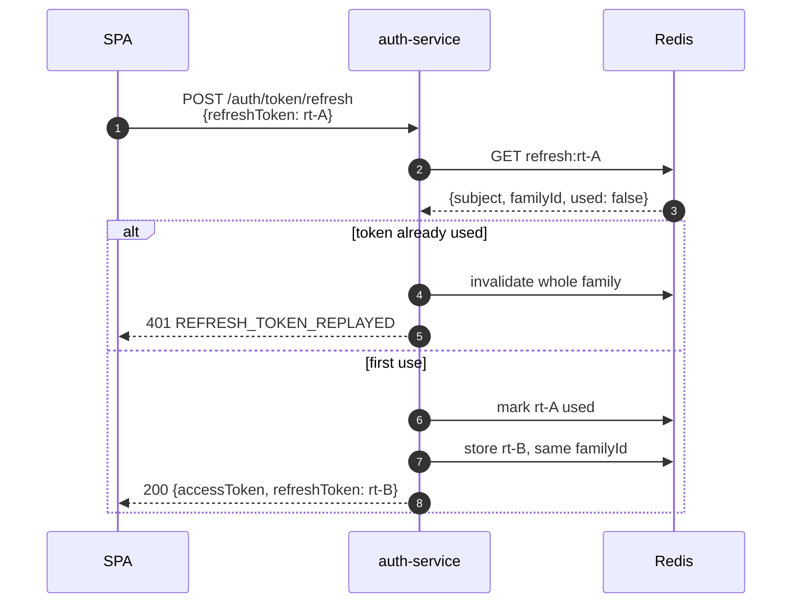
```mermaid
sequenceDiagram
    autonumber
    participant APP as SPA
    participant AUTH as auth-service
    participant RD as Redis

    APP->>AUTH: POST /auth/token/refresh<br/>{refreshToken: rt-A}
    AUTH->>RD: GET refresh:rt-A
    RD-->>AUTH: {subject, familyId, used: false}
    alt token already used
        AUTH->>RD: invalidate whole family
        AUTH-->>APP: 401 REFRESH_TOKEN_REPLAYED
    else first use
        AUTH->>RD: mark rt-A used
        AUTH->>RD: store rt-B, same familyId
        AUTH-->>APP: 200 {accessToken, refreshToken: rt-B}
    end
```

The check and the mark are one Lua script (`RedisRefreshTokenStore.consume`), so two concurrent refreshes of one token cannot both succeed. Tokens are stored hashed, and logout revokes the whole family. See review sections 8.2 and 16.6.

### 5.3 Booking creation through to provider acceptance

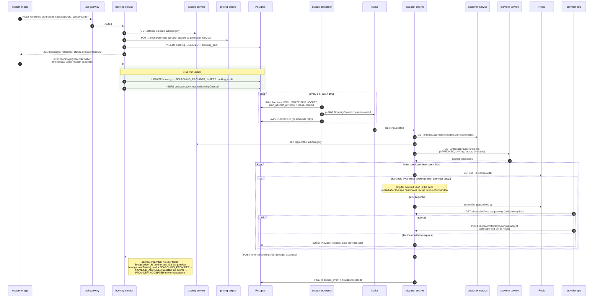
```mermaid
sequenceDiagram
    autonumber
    participant APP as customer-app
    participant GW as api-gateway
    participant BOOK as booking-service
    participant CAT as catalog-service
    participant PRICE as pricing-engine
    participant PG as Postgres
    participant OUT as outbox-processor
    participant KF as Kafka
    participant DISP as dispatch-engine
    participant CUST as customer-service
    participant PROV as provider-service
    participant RD as Redis
    participant PAPP as provider-app

    APP->>GW: POST /bookings {addressId, subcategoryId, couponCode?}
    GW->>BOOK: routed
    BOOK->>CAT: GET catalog, validate subcategory
    BOOK->>PRICE: POST /pricing/estimate (coupon quoted by promotion-service)
    BOOK->>PG: INSERT booking (CREATED) + booking_audit
    BOOK-->>APP: 201 {bookingId, reference, status, priceBreakdown}

    APP->>BOOK: POST /bookings/{ref}/confirmation<br/>(emergency: same request as create)
    rect rgb(240, 248, 240)
    note over BOOK,PG: One transaction
    BOOK->>PG: UPDATE booking → SEARCHING_PROVIDER, INSERT booking_audit
    BOOK->>PG: INSERT outbox.outbox_event (BookingCreated)
    end

    loop every 1 s, batch 100
        OUT->>PG: claim due rows: FOR UPDATE SKIP LOCKED,<br/>next_attempt_at = now + lease, commit
        OUT->>KF: publish BookingCreated, header eventId
        OUT->>PG: mark PUBLISHED (or schedule retry)
    end

    KF->>DISP: BookingCreated
    DISP->>CUST: GET /internal/addresses/{addressId} (coordinates)
    DISP->>CAT: skill tags of the subcategory
    DISP->>PROV: GET /internal/providers/eligible<br/>(APPROVED, skill tag, radius, available)
    PROV-->>DISP: scored candidates

    loop each candidate, best score first
        DISP->>RD: SET NX PX lock:provider
        alt lock held by another booking's offer (provider busy)
            note over DISP: skip for now but keep in the pool:<br/>retried after the free candidates, for up to one offer window
        else lock acquired
            DISP->>RD: store offer (window 60 s)
            PAPP->>DISP: GET /dispatch/offers via gateway (polled every 5 s)
            alt accept
                PAPP->>DISP: POST /dispatch/offers/{bookingId}/accept<br/>(compare-and-set in Redis)
            else decline or window expires
                DISP->>PG: outbox ProviderRejected, drop provider, next
            end
        end
    end

    DISP->>BOOK: POST /internal/bookings/{id}/provider-accepted
    note right of BOOK: service credential, no user token.<br/>Sets provider_id (and tenant_id if the provider<br/>belongs to a Tenant), walks SEARCHING_PROVIDER →<br/>PROVIDER_ASSIGNED (audited, no event) →<br/>PROVIDER_ACCEPTED in one transaction.
    DISP->>PG: INSERT outbox_event (ProviderAccepted)
```

If no candidate accepts within the configured radius cycles, dispatch calls `POST /internal/bookings/{id}/searching-failed`, and booking-service either routes the booking to the covering Tenants (`AWAITING_ASSIGNMENT`, section 5.8) or fails it (`SEARCHING_FAILED`, announced as `BookingCancelled`). Dispatch sends its own "no provider" notices only in the second case.

Offers live only in Redis: the provider app reads and answers them through the gateway (`/dispatch/offers/**`, SERVICE_PROVIDER only, matched to the JWT subject), and a late or double answer is refused by the compare-and-set. A `BookingCancelled` stops an in-flight search and withdraws the pending offer. Two gaps remain: a dispatch failure after `BookingCreated` is acknowledged (outage, restart mid-search) leaves the booking in `SEARCHING_PROVIDER` with no sweeper, and the `provider-accepted` call and the `ProviderAccepted` row are a dual write. See review sections 16.1, 17.1 and 17.5.

### 5.4 Job execution milestones

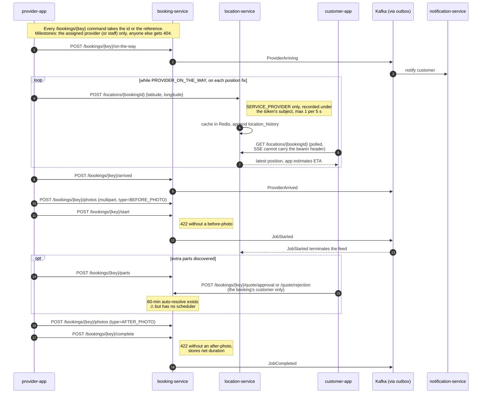
```mermaid
sequenceDiagram
    autonumber
    participant PAPP as provider-app
    participant BOOK as booking-service
    participant LOC as location-service
    participant CAPP as customer-app
    participant KF as Kafka (via outbox)
    participant NOTIF as notification-service

    note over PAPP,BOOK: Every /bookings/{key} command takes the id or the reference.<br/>Milestones: the assigned provider (or staff) only, anyone else gets 404.
    PAPP->>BOOK: POST /bookings/{key}/on-the-way
    BOOK->>KF: ProviderArriving
    KF->>NOTIF: notify customer

    loop while PROVIDER_ON_THE_WAY, on each position fix
        PAPP->>LOC: POST /locations/{bookingId} {latitude, longitude}
        note right of LOC: SERVICE_PROVIDER only, recorded under<br/>the token's subject, max 1 per 5 s
        LOC->>LOC: cache in Redis, append location_history
        CAPP->>LOC: GET /locations/{bookingId} (polled,<br/>SSE cannot carry the bearer header)
        LOC-->>CAPP: latest position, app estimates ETA
    end

    PAPP->>BOOK: POST /bookings/{key}/arrived
    BOOK->>KF: ProviderArrived
    PAPP->>BOOK: POST /bookings/{key}/photos (multipart, type=BEFORE_PHOTO)
    PAPP->>BOOK: POST /bookings/{key}/start
    note right of BOOK: 422 without a before-photo
    BOOK->>KF: JobStarted
    KF-->>LOC: JobStarted terminates the feed

    opt extra parts discovered
        PAPP->>BOOK: POST /bookings/{key}/parts
        CAPP->>BOOK: POST /bookings/{key}/quote/approval or /quote/rejection<br/>(the booking's customer only)
        note over BOOK: 60-min auto-resolve exists<br/>⚠ but has no scheduler
    end

    PAPP->>BOOK: POST /bookings/{key}/photos (type=AFTER_PHOTO)
    PAPP->>BOOK: POST /bookings/{key}/complete
    note right of BOOK: 422 without an after-photo,<br/>stores net duration
    BOOK->>KF: JobCompleted
```

Ownership is enforced in one place (`service/BookingAccess`): the assigned provider for milestones, photos, pause and parts; the customer for confirmation and quote decisions; either to cancel; staff for all. The job detail (`GET /bookings/{key}`) carries the service address and coordinates, the photos, the parts and the net duration. Location reads are still not ownership-checked: any signed-in customer or provider with a booking id can read its provider's position (review 17.5).

### 5.5 Payment, invoice and review prompt

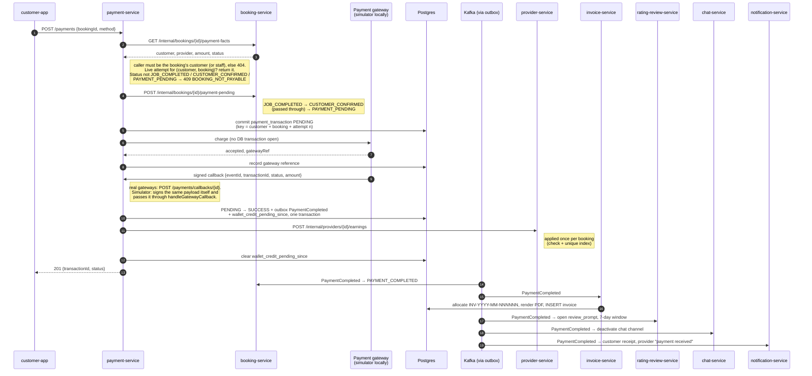
```mermaid
sequenceDiagram
    autonumber
    participant APP as customer-app
    participant PAY as payment-service
    participant BOOK as booking-service
    participant GWY as Payment gateway<br/>(simulator locally)
    participant PG as Postgres
    participant KF as Kafka (via outbox)
    participant PROV as provider-service
    participant INV as invoice-service
    participant RATE as rating-review-service
    participant CHAT as chat-service
    participant NOTIF as notification-service

    APP->>PAY: POST /payments {bookingId, method}
    PAY->>BOOK: GET /internal/bookings/{id}/payment-facts
    BOOK-->>PAY: customer, provider, amount, status
    note right of PAY: caller must be the booking's customer (or staff), else 404.<br/>Live attempt for (customer, booking)? return it.<br/>Status not JOB_COMPLETED / CUSTOMER_CONFIRMED /<br/>PAYMENT_PENDING → 409 BOOKING_NOT_PAYABLE
    PAY->>BOOK: POST /internal/bookings/{id}/payment-pending
    note right of BOOK: JOB_COMPLETED → CUSTOMER_CONFIRMED<br/>(passed through) → PAYMENT_PENDING
    PAY->>PG: commit payment_transaction PENDING<br/>(key = customer + booking + attempt n)
    PAY->>GWY: charge (no DB transaction open)
    GWY-->>PAY: accepted, gatewayRef
    PAY->>PG: record gateway reference

    GWY->>PAY: signed callback {eventId, transactionId, status, amount}
    note right of PAY: real gateways: POST /payments/callbacks/{id}.<br/>Simulator: signs the same payload itself and<br/>passes it through handleGatewayCallback.
    PAY->>PG: PENDING → SUCCESS + outbox PaymentCompleted<br/>+ wallet_credit_pending_since, one transaction
    PAY->>PROV: POST /internal/providers/{id}/earnings
    note right of PROV: applied once per booking<br/>(check + unique index)
    PAY->>PG: clear wallet_credit_pending_since
    PAY-->>APP: 201 {transactionId, status}

    KF->>BOOK: PaymentCompleted → PAYMENT_COMPLETED
    KF->>INV: PaymentCompleted
    INV->>PG: allocate INV-YYYY-MM-NNNNNN, render PDF, INSERT invoice
    KF->>RATE: PaymentCompleted → open review_prompt, 7-day window
    KF->>CHAT: PaymentCompleted → deactivate chat channel
    KF->>NOTIF: PaymentCompleted → customer receipt, provider "payment received"
```

The client sends only the booking and the method; amount, provider and customer come from booking-service, so a tampered amount in the request is ignored. The PENDING row commits before the gateway is called, so a charge never happens without a record; a gateway error leaves it PENDING for the callback to settle. A FAILED payment can be retried as a new attempt (at most 10 per booking). A wallet credit that could not be confirmed keeps its marker and is re-sent by `WalletCreditSweeper` every minute once it is five minutes old, which is why provider-service must apply a booking's credit only once.

The simulator gateway exists only when `PAYMENT_SIMULATOR_ENABLED=true` (Compose sets it, Helm never does) and logs a WARN at startup; otherwise `simulator` is an unknown gateway. With Razorpay or Stripe a payment stays PENDING until their signed webhook arrives. The booking-side handler never fails on a `PaymentCompleted` it cannot apply (cancelled, disputed, unknown booking): it logs a WARN and acknowledges. Settlement reversals still have no provider-service endpoint. See review section 17.6.

### 5.6 Provider onboarding and verification

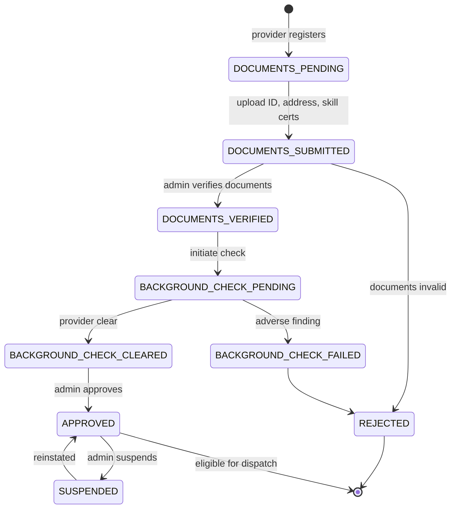
```mermaid
stateDiagram-v2
    [*] --> DOCUMENTS_PENDING: provider registers
    DOCUMENTS_PENDING --> DOCUMENTS_SUBMITTED: upload ID, address, skill certs
    DOCUMENTS_SUBMITTED --> DOCUMENTS_VERIFIED: admin verifies documents
    DOCUMENTS_SUBMITTED --> REJECTED: documents invalid
    DOCUMENTS_VERIFIED --> BACKGROUND_CHECK_PENDING: initiate check
    BACKGROUND_CHECK_PENDING --> BACKGROUND_CHECK_CLEARED: provider clear
    BACKGROUND_CHECK_PENDING --> BACKGROUND_CHECK_FAILED: adverse finding
    BACKGROUND_CHECK_CLEARED --> APPROVED: admin approves
    BACKGROUND_CHECK_FAILED --> REJECTED
    APPROVED --> SUSPENDED: admin suspends
    SUSPENDED --> APPROVED: reinstated
    REJECTED --> [*]
    APPROVED --> [*]: eligible for dispatch
```

State names follow `VerificationStatus` in verification-service. Only `APPROVED` makes a provider eligible for job assignment. The document bytes are discarded by the storage stub. The upload and record-read endpoints assert that the caller is the provider named in the path, or staff. The eligibility check deliberately does not, because dispatch asks about other providers. See review sections 8.5 and 12.1.

### 5.7 Complaint lifecycle with SLA

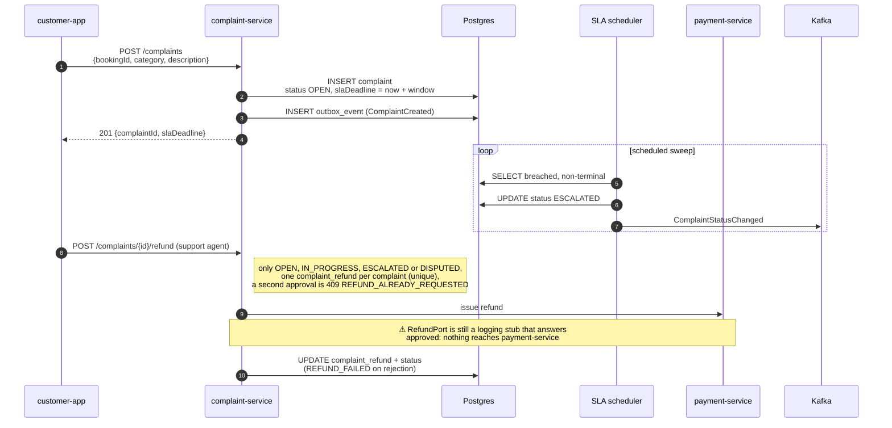
```mermaid
sequenceDiagram
    autonumber
    participant APP as customer-app
    participant CMPL as complaint-service
    participant PG as Postgres
    participant SCHED as SLA scheduler
    participant PAY as payment-service
    participant KF as Kafka

    APP->>CMPL: POST /complaints<br/>{bookingId, category, description}
    CMPL->>PG: INSERT complaint<br/>status OPEN, slaDeadline = now + window
    CMPL->>PG: INSERT outbox_event (ComplaintCreated)
    CMPL-->>APP: 201 {complaintId, slaDeadline}

    loop scheduled sweep
        SCHED->>PG: SELECT breached, non-terminal
        SCHED->>PG: UPDATE status ESCALATED
        SCHED->>KF: ComplaintStatusChanged
    end

    APP->>CMPL: POST /complaints/{id}/refund (support agent)
    note right of CMPL: only OPEN, IN_PROGRESS, ESCALATED or DISPUTED,<br/>one complaint_refund per complaint (unique),<br/>a second approval is 409 REFUND_ALREADY_REQUESTED
    CMPL->>PAY: issue refund
    note over CMPL,PAY: ⚠ RefundPort is still a logging stub that answers<br/>approved: nothing reaches payment-service
    CMPL->>PG: UPDATE complaint_refund + status<br/>(REFUND_FAILED on rejection)
```

---

### 5.8 Fallback to a Tenant (service agency)

When automatic matching finds nobody, the booking is offered to the Tenants (agencies) whose service
area and categories cover it, instead of failing. Spec: `.kiro/specs/multi-tenant-and-mobile/`.

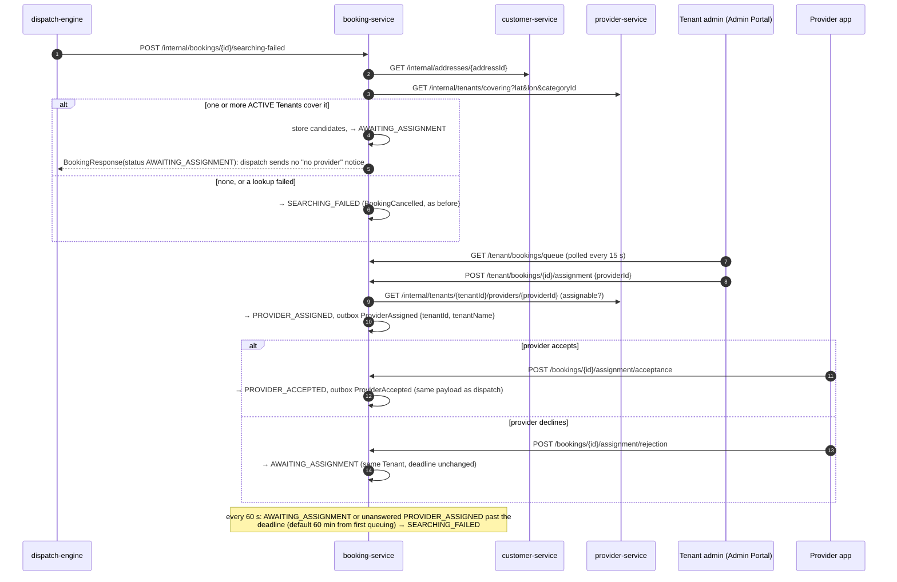
```mermaid
sequenceDiagram
    autonumber
    participant D as dispatch-engine
    participant B as booking-service
    participant C as customer-service
    participant P as provider-service
    participant T as Tenant admin (Admin Portal)
    participant A as Provider app

    D->>B: POST /internal/bookings/{id}/searching-failed
    B->>C: GET /internal/addresses/{addressId}
    B->>P: GET /internal/tenants/covering?lat&lon&categoryId
    alt one or more ACTIVE Tenants cover it
        B->>B: store candidates, → AWAITING_ASSIGNMENT
        B-->>D: BookingResponse(status AWAITING_ASSIGNMENT): dispatch sends no "no provider" notice
    else none, or a lookup failed
        B->>B: → SEARCHING_FAILED (BookingCancelled, as before)
    end
    T->>B: GET /tenant/bookings/queue (polled every 15 s)
    T->>B: POST /tenant/bookings/{id}/assignment {providerId}
    B->>P: GET /internal/tenants/{tenantId}/providers/{providerId} (assignable?)
    B->>B: → PROVIDER_ASSIGNED, outbox ProviderAssigned {tenantId, tenantName}
    alt provider accepts
        A->>B: POST /bookings/{id}/assignment/acceptance
        B->>B: → PROVIDER_ACCEPTED, outbox ProviderAccepted (same payload as dispatch)
    else provider declines
        A->>B: POST /bookings/{id}/assignment/rejection
        B->>B: → AWAITING_ASSIGNMENT (same Tenant, deadline unchanged)
    end
    Note over B: every 60 s: AWAITING_ASSIGNMENT or unanswered PROVIDER_ASSIGNED past the<br/>deadline (default 60 min from first queuing) → SEARCHING_FAILED
```

The first assignment wins: a second Tenant admin assigning the same booking gets
409 `BOOKING_NOT_ASSIGNABLE` (optimistic lock). A Tenant admin sees only bookings for which their
Tenant was a candidate, plus their Tenant's own jobs; anything else answers 404. A booking whose
accepting provider belongs to a Tenant records that Tenant (`booking.tenant_id`), whichever path
matched it. Only the assigned provider can accept or decline (staff cannot answer for them); a
decline clears the provider and returns the booking to the assigning Tenant's queue only.

## 6. Event topology

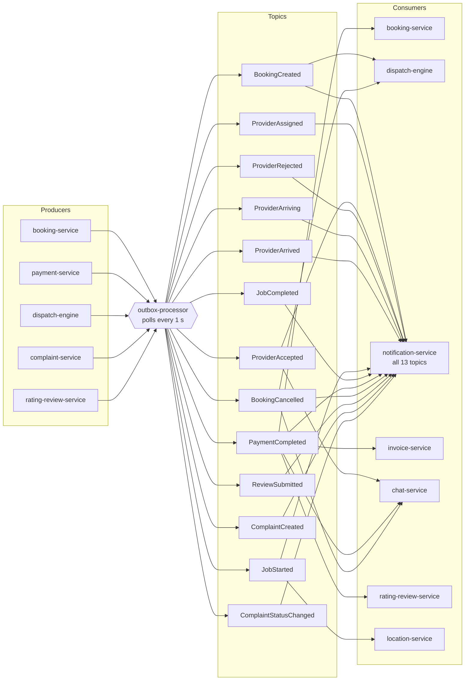
```mermaid
graph LR
    subgraph Producers
        BOOK["booking-service"]
        PAY["payment-service"]
        DISP["dispatch-engine"]
        CMPL["complaint-service"]
        RATE["rating-review-service"]
    end

    OUT{{"outbox-processor<br/>polls every 1 s"}}

    subgraph Topics
        T1["BookingCreated"]
        T2["ProviderAssigned"]
        T3["ProviderAccepted"]
        T4["ProviderRejected"]
        T5["ProviderArriving"]
        T6["ProviderArrived"]
        T7["JobStarted"]
        T8["JobCompleted"]
        T9["PaymentCompleted"]
        T10["BookingCancelled"]
        T11["ReviewSubmitted"]
        T12["ComplaintCreated"]
        T13["ComplaintStatusChanged"]
    end

    subgraph Consumers
        CBOOK["booking-service"]
        CDISP["dispatch-engine"]
        CNOTIF["notification-service<br/>all 13 topics"]
        CINV["invoice-service"]
        CCHAT["chat-service"]
        CRATE["rating-review-service"]
        CLOC["location-service"]
    end

    BOOK --> OUT
    PAY --> OUT
    DISP --> OUT
    CMPL --> OUT
    RATE --> OUT

    OUT --> T1 & T2 & T3 & T4 & T5 & T6 & T7 & T8 & T9 & T10 & T11
    OUT --> T12 & T13

    T1 --> CDISP
    T10 --> CDISP
    T3 --> CCHAT
    T9 --> CBOOK
    T9 --> CINV
    T9 --> CRATE
    T9 --> CCHAT
    T10 --> CCHAT
    T7 --> CLOC
    T1 & T2 & T3 & T4 & T5 & T6 & T7 & T8 & T9 & T10 & T11 & T12 & T13 --> CNOTIF
```

| Topic | Produced by | When |
| --- | --- | --- |
| BookingCreated | booking-service | booking enters `SEARCHING_PROVIDER` (confirmation, or emergency create) |
| ProviderAssigned | booking-service | **only** when a Tenant admin assigns a provider; carries `tenantId`, `tenantName`. Dispatch's acceptance passes through `PROVIDER_ASSIGNED` without publishing it |
| ProviderAccepted | dispatch-engine; booking-service | dispatch: a provider accepted an offer. booking-service: a Tenant-assigned provider accepted. Same payload either way |
| ProviderRejected | dispatch-engine | an offer was declined or expired (not a Tenant-assignment decline) |
| ProviderArriving, ProviderArrived, JobStarted, JobCompleted | booking-service | job milestones (5.4) |
| BookingCancelled | booking-service | `CANCELLED` or `SEARCHING_FAILED` (dispatch failure, or the Tenant assignment deadline) |
| PaymentCompleted | payment-service | a transaction reached `SUCCESS` |
| ReviewSubmitted | rating-review-service | review submitted |
| ComplaintCreated, ComplaintStatusChanged | complaint-service | complaint lifecycle |

Consumer groups: `booking-service.payment-completed`, `dispatch-engine.booking-created`, `dispatch-engine.booking-cancelled`, `notification-service.lifecycle`, `invoice-service.payment-completed`, `chat-service.lifecycle`, `rating-review-service.payment-completed`, `location-service.job-started`. Any event type without an explicit mapping falls through to the `domain-events` topic, where nothing subscribes; all thirteen above are mapped. Ratings are not consumed by provider-service, so reviews never change a provider's aggregate rating (review 17.5).

### Outbox and delivery guarantees

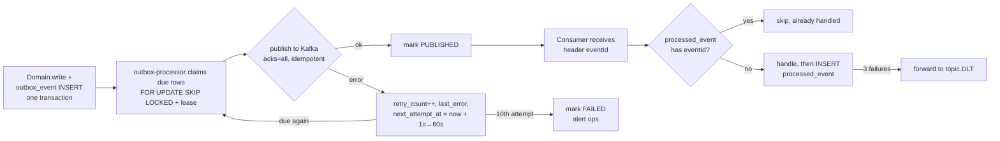
```mermaid
flowchart LR
    A["Domain write +<br/>outbox_event INSERT<br/>one transaction"] --> B["outbox-processor claims due rows<br/>FOR UPDATE SKIP LOCKED + lease"]
    B --> C{"publish to Kafka<br/>acks=all, idempotent"}
    C -->|ok| D["mark PUBLISHED"]
    C -->|error| E["retry_count++, last_error,<br/>next_attempt_at = now + 1s→60s"]
    E -->|"due again"| B
    E -->|"10th attempt"| F["mark FAILED<br/>alert ops"]
    D --> G["Consumer receives<br/>header eventId"]
    G --> H{"processed_event<br/>has eventId?"}
    H -->|yes| I["skip, already handled"]
    H -->|no| J["handle, then INSERT<br/>processed_event"]
    J -->|"3 failures"| K["forward to topic.DLT"]
```

The publisher requires `Propagation.MANDATORY`, so an outbox row can only be written inside an existing transaction. The producer template refuses to start unless `acks=all` and idempotence are enabled.

The relay claims rows in a short transaction (`SELECT ... FOR UPDATE SKIP LOCKED`, then `next_attempt_at` = now + a 2-minute lease) and publishes outside it, so several relay instances can run without two of them working one row. A failed publish is not slept on: the attempt, its error and the next attempt time are written to the row, and the row is simply not due until then. Delivery is at-least-once (a crash between the broker ACK and the PUBLISHED write, a timed-out publish that still lands, or a relay outliving its lease can each publish twice), which consumer dedupe on `eventId` absorbs. The consumer's 5-second retry delay is likewise a paused listener container rather than a sleeping thread. The `processed_event` insert and the handler share one transaction (insert first), so a failure rolls both back and the redelivery runs the handler again; retriable broker outages no longer spend relay attempts, and a dead-letter send is awaited before the offset commits. See review sections 8.2 and 16.5.

---

## 7. Data model

Each service owns one PostgreSQL schema in a single database, and no service reads another's schema. Cross-service references are plain UUID columns with no foreign key (`booking.tenant_id` refers to `provider.tenant` by value only).

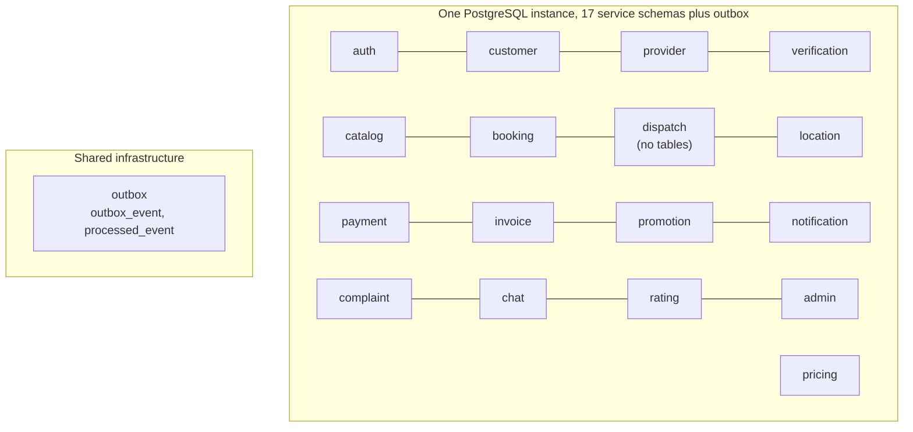
```mermaid
graph TB
    subgraph "One PostgreSQL instance, 17 service schemas plus outbox"
        S1["auth"] --- S2["customer"] --- S3["provider"] --- S4["verification"]
        S5["catalog"] --- S6["booking"] --- S7["dispatch<br/>(no tables)"] --- S8["location"]
        S9["payment"] --- S10["invoice"] --- S11["promotion"] --- S12["notification"]
        S13["complaint"] --- S14["chat"] --- S15["rating"] --- S16["admin"]
        S17["pricing"]
    end
    subgraph "Shared infrastructure"
        OB["outbox<br/>outbox_event, processed_event"]
    end
```

The outbox tables are the deliberate exception to the one-schema-per-service rule. They are infrastructure rather than domain data, and every producer plus the relay must agree on where they live, so they sit in a single shared `outbox` schema. Atomicity is unaffected: a producer still writes its event row in the same transaction as its domain change, in the same database. Before this, each producer wrote into its own schema while the relay polled another, so no event was ever published.

Every database-backed service runs Flyway from `src/main/resources/db/migration`, and Hibernate only validates (`ddl-auto: validate`, also in Compose). `docker/init-db.sql` creates the schemas only. Each `V1__baseline` was generated from the entities and must not be edited; later changes are incremental (`baseline-on-migrate` lets a database created by the old `ddl-auto=update` setup adopt them). The shared outbox tables ship as a repeatable migration in `homefix-shared-outbox`. See review section 16.7. Migrations after the baseline:

| Service | Migration | Change |
| --- | --- | --- |
| auth-service | V2 | `user_account.status` (ACTIVE, SUSPENDED, DEACTIVATED), index on `created_at` |
| auth-service | V3 | `TENANT_ADMIN` added to the role check |
| booking-service | V2 | index `(customer_id, created_at)` for history |
| booking-service | V3 | `AWAITING_ASSIGNMENT` in the status checks; `booking.tenant_id`, `booking.queued_for_assignment_at`; table `booking_tenant_candidate` |
| provider-service | V2 | unique index: one `JOB_CREDIT` earning per booking |
| provider-service | V3 | tables `tenant`, `tenant_category`, `tenant_admin`; `provider_profile.tenant_id` |
| notification-service | V2, V3 | table `notification_template` (seeded with the built-in texts); Tenant-assignment templates |
| complaint-service | V2 | `complaint.resolution_note` |
| admin-service | V2, V3 | table `system_setting`; keyset index on `audit_log (logged_at, id)` |

### 7.1 Identity and profiles

Schemas `auth`, `customer`, `provider`, `verification`.

```mermaid
erDiagram
    USER_ACCOUNT {
        uuid id PK
        string mobile_number UK "nullable for social accounts"
        string username UK "seeded and staff accounts"
        string password_hash
        string status "ACTIVE, SUSPENDED, DEACTIVATED"
        boolean verified
        timestamp created_at
    }
    USER_ACCOUNT_ROLE {
        uuid user_id FK
        string role "CUSTOMER, SERVICE_PROVIDER, ADMIN, SUPER_ADMIN, FINANCE_ADMIN, DISPATCHER, SUPPORT_AGENT, TENANT_ADMIN"
    }
    SOCIAL_IDENTITY_LINK {
        uuid id PK
        string provider "GOOGLE, APPLE"
        string provider_subject
        uuid user_id FK
        timestamp created_at
    }
    CUSTOMER_PROFILE {
        uuid id PK
        uuid user_id UK "refers to auth.user_account.id"
        bytes display_name_encrypted "AES-GCM"
        bytes email_encrypted "AES-GCM"
        string photo_url
        boolean anonymized
        timestamp updated_at
    }
    ADDRESS {
        uuid id PK
        uuid customer_id FK
        string label
        decimal lat
        decimal lng
        bytes address_text_encrypted "AES-GCM"
        boolean is_default
        boolean is_active
        timestamp created_at
    }
    DELETION_REQUEST {
        uuid id PK
        uuid customer_id
        string status
        timestamp requested_at
        timestamp acknowledged_at
        timestamp anonymize_after
        timestamp anonymized_at
    }
    PROVIDER_PROFILE {
        uuid id PK
        uuid user_id UK
        string display_name
        int years_experience
        int service_radius_km
        double base_latitude "dispatch origin"
        double base_longitude
        uuid tenant_id FK "null unless in a Tenant's team"
        decimal aggregate_rating
        decimal wallet_balance
        boolean emergency_available
        boolean under_review
        bytes bank_account_encrypted "AES-GCM"
        boolean bank_account_verified
        long version
    }
    PROVIDER_SKILL_TAG {
        uuid provider_id FK
        string tag
    }
    TENANT {
        uuid id PK
        string name
        string status "ACTIVE, SUSPENDED"
        string contact_phone
        string contact_email
        double base_latitude
        double base_longitude
        decimal service_radius_km "1-100"
        long version
    }
    TENANT_CATEGORY {
        uuid tenant_id PK
        uuid category_id PK
    }
    TENANT_ADMIN {
        uuid user_id PK "one Tenant per admin"
        uuid tenant_id FK
    }
    AVAILABILITY_SLOT {
        uuid id PK
        int day_of_week
        int start_hour
        int end_hour
    }
    PROVIDER_CATEGORY_SELECTION {
        uuid id PK
        uuid category_id
        uuid subcategory_id
    }
    PROVIDER_EARNING {
        uuid id PK
        uuid provider_id
        uuid booking_id "unique for JOB_CREDIT"
        string booking_reference
        string type "JOB_CREDIT, PLATFORM_FEE_DEDUCTION, PENALTY_DEDUCTION"
        decimal gross
        decimal platform_fee
        decimal net
        timestamp credited_at
    }
    SETTLEMENT_PROV {
        uuid id PK
        uuid provider_id
        decimal amount
        string status
        bytes bank_account_ref_encrypted
        timestamp requested_at
        timestamp completed_at
    }
    VERIFICATION {
        uuid id PK
        uuid provider_id UK
        enum status "DOCUMENTS_PENDING to APPROVED"
        timestamp background_check_started_at
        string background_check_result
        long version
    }
    VERIFICATION_DOCUMENT {
        uuid id PK
        string document_type
        string storage_ref "s3:// ref, bytes discarded by stub"
        string content_type
        long size_bytes
        timestamp uploaded_at
    }
    VERIFICATION_AUDIT_ENTRY {
        uuid id PK
        int sequence "contiguous chain"
        enum from_state
        enum to_state
        uuid actor_id
        string reason
        timestamp created_at
    }

    USER_ACCOUNT ||--o{ USER_ACCOUNT_ROLE : holds
    USER_ACCOUNT ||--o{ SOCIAL_IDENTITY_LINK : linked
    USER_ACCOUNT ||--o| CUSTOMER_PROFILE : "by user_id"
    CUSTOMER_PROFILE ||--o{ ADDRESS : has
    USER_ACCOUNT ||--o| PROVIDER_PROFILE : "by user_id"
    PROVIDER_PROFILE ||--o{ PROVIDER_SKILL_TAG : has
    TENANT ||--o{ PROVIDER_PROFILE : "team, by tenant_id"
    TENANT ||--o{ TENANT_CATEGORY : covers
    TENANT ||--o{ TENANT_ADMIN : "administered by"
    USER_ACCOUNT ||--o| TENANT_ADMIN : "by user_id"
    PROVIDER_PROFILE ||--o{ AVAILABILITY_SLOT : offers
    PROVIDER_PROFILE ||--o{ PROVIDER_CATEGORY_SELECTION : serves
    PROVIDER_PROFILE ||--o{ PROVIDER_EARNING : earns
    PROVIDER_PROFILE ||--o{ SETTLEMENT_PROV : withdraws
    PROVIDER_PROFILE ||--o| VERIFICATION : "by provider_id"
    VERIFICATION ||--o{ VERIFICATION_DOCUMENT : contains
    VERIFICATION ||--o{ VERIFICATION_AUDIT_ENTRY : audits
```

`PROVIDER_PROFILE`, `TENANT`, `VERIFICATION`, `PAYMENT_TRANSACTION`, `COUPON` and the catalog tables carry `@Version` optimistic locking; most child tables do not. The provider profile's id is the same value as its `user_id`. The tenant tables, and the foreign key from `provider_profile.tenant_id`, live inside the `provider` schema; a Tenant admin is linked by `user_id` to an auth account that holds `TENANT_ADMIN`, granted and revoked by provider-service through auth-service's internal API. Personally identifying fields are stored as AES-GCM ciphertext with a random 96-bit IV, and the column names carry the `_encrypted` suffix.

Two model-level defects. `CUSTOMER_PROFILE` is looked up by primary key in service code while the customer id actually lives in `user_id`, which breaks the second profile update, every deletion request and the anonymization sweep. `VERIFICATION` declared both of its child collections as eager `List` bags. Hibernate 6.4 accepts that mapping but loads each bag with its own extra SELECT, so every lookup, the dispatch eligibility check included, took three statements and loaded every child row. Both collections are now lazy. Reads that need the whole aggregate fetch-join the documents and load the audit trail with one more statement, inside the transaction. See review sections 8.4 and 8.5.

### 7.2 Catalog, booking and dispatch

```mermaid
erDiagram
    SERVICE_CATEGORY {
        uuid id PK
        string name
        string description
        string icon_url
        int display_order
        boolean is_active
        timestamp created_at
        timestamp updated_at
        long version
    }
    SERVICE_SUBCATEGORY {
        uuid id PK
        uuid category_id FK
        string name
        decimal base_price
        int estimated_duration_min
        string tag "skill tag, element collection"
        boolean emergency_available
        boolean is_active
        long version
    }
    BOOKING {
        uuid id PK
        string reference UK "generated booking reference"
        uuid customer_id
        uuid provider_id "set on acceptance or Tenant assignment"
        uuid tenant_id "the accepting provider's Tenant, if any"
        uuid category_id
        uuid subcategory_id
        uuid address_id
        enum status "19 states, CREATED to REFUNDED"
        boolean is_emergency
        timestamp scheduled_at
        decimal estimated_total
        decimal final_total
        decimal cancellation_fee
        string saga_state
        timestamp queued_for_assignment_at "first Tenant queuing; deadline clock"
        timestamp created_at
        timestamp started_at
        timestamp completed_at
        int net_duration_seconds
        long version "optimistic lock"
    }
    BOOKING_TENANT_CANDIDATE {
        uuid booking_id PK
        uuid tenant_id PK "snapshotted at fallback"
    }
    PRICING_PARAMETERS {
        uuid subcategory_id PK
        decimal base_price
        decimal per_km_rate
        decimal emergency_multiplier
        decimal platform_fee_rate
        decimal tax_rate
    }
    BOOKING_AUDIT {
        uuid id PK
        uuid booking_id FK
        enum from_state
        enum to_state
        uuid actor_id
        string actor_role
        timestamp transitioned_at
        string reason
    }
    JOB_INTERVAL {
        uuid id PK
        uuid booking_id FK
        string kind "WORK or PAUSE"
        timestamp started_at
        timestamp ended_at
        string reason
    }
    JOB_MEDIA {
        uuid id PK
        uuid booking_id FK
        string type "BEFORE_PHOTO or AFTER_PHOTO for job photos"
        string content_type
        long size_bytes
        string s3_key
        timestamp uploaded_at
    }
    PARTS_LINE_ITEM {
        uuid id PK
        uuid booking_id FK
        string item_name
        int quantity
        decimal unit_cost
        timestamp added_at
    }
    SAGA_STEP {
        uuid id PK
        uuid booking_id FK
        int sequence_no
        string step_name
        string status "STARTED, COMPLETED, FAILED, COMPENSATED"
        timestamp recorded_at
        timestamp completed_at
        timestamp compensated_at
        string detail
    }
    LOCATION_HISTORY {
        uuid id PK
        uuid booking_id
        uuid provider_id
        decimal latitude
        decimal longitude
        timestamp recorded_at
    }
    TERMINATED_BOOKING {
        uuid booking_id PK
        timestamp terminated_at
    }
    OUTBOX_EVENT {
        uuid id PK
        string aggregate_type
        uuid aggregate_id
        string event_type
        text payload
        string status "PENDING, PUBLISHED, FAILED"
        int retry_count
        timestamp created_at
        timestamp published_at
        timestamp next_attempt_at "claim lease or next retry; null = due"
        string last_error
        long version
    }
    PROCESSED_EVENT {
        string consumer_group PK
        uuid event_id PK
        timestamp processed_at
    }

    SERVICE_CATEGORY ||--o{ SERVICE_SUBCATEGORY : contains
    BOOKING ||--o{ BOOKING_AUDIT : audits
    BOOKING ||--o{ BOOKING_TENANT_CANDIDATE : "offered to"
    BOOKING ||--o{ JOB_INTERVAL : tracks
    BOOKING ||--o{ JOB_MEDIA : documents
    BOOKING ||--o{ PARTS_LINE_ITEM : quotes
    BOOKING ||--o{ SAGA_STEP : orchestrates
    BOOKING ||--o{ LOCATION_HISTORY : "tracked by booking_id"
```

`outbox_event` and `processed_event` come from the shared outbox module and live once, in the shared `outbox` schema, not in each service's schema. `processed_event` is keyed by consumer group and event id, so services consuming the same event deduplicate independently. The payload is stored as `text`, not `jsonb` as the design document specifies; it was briefly a large-object `oid`, which broke the relay (see CODEBASE_REVIEW.md 15.2). `location_history` and `terminated_booking` live in the `location` schema, not `booking`; `pricing_parameters` (abridged above) lives in the `pricing` schema, so pricing survives a restart. The dispatch schema has no tables: offers and per-provider locks are in Redis, and dispatch's outbox rows go to the shared `outbox` schema.

Child tables such as `booking_audit` and `saga_step` use assigned UUID primary keys with no `@Version` and no `Persistable` implementation, so every save costs a SELECT before the INSERT.

### 7.3 Money

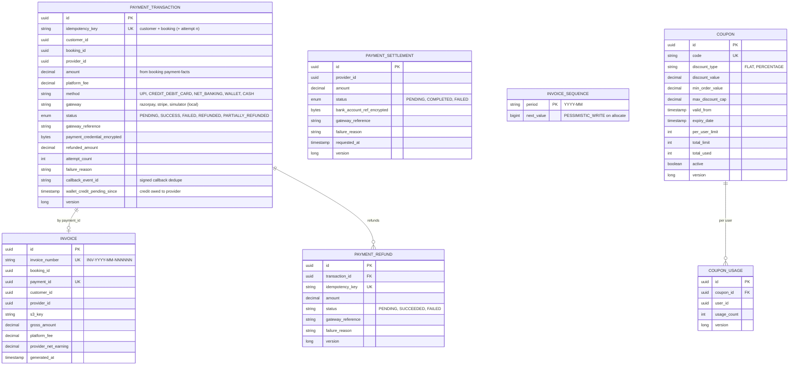
```mermaid
erDiagram
    PAYMENT_TRANSACTION {
        uuid id PK
        string idempotency_key UK "customer + booking (+ attempt n)"
        uuid customer_id
        uuid booking_id
        uuid provider_id
        decimal amount "from booking payment-facts"
        decimal platform_fee
        string method "UPI, CREDIT_DEBIT_CARD, NET_BANKING, WALLET, CASH"
        string gateway "razorpay, stripe, simulator (local)"
        enum status "PENDING, SUCCESS, FAILED, REFUNDED, PARTIALLY_REFUNDED"
        string gateway_reference
        bytes payment_credential_encrypted
        decimal refunded_amount
        int attempt_count
        string failure_reason
        string callback_event_id "signed callback dedupe"
        timestamp wallet_credit_pending_since "credit owed to provider"
        long version
    }
    PAYMENT_REFUND {
        uuid id PK
        uuid transaction_id FK
        string idempotency_key UK
        decimal amount
        string status "PENDING, SUCCEEDED, FAILED"
        string gateway_reference
        string failure_reason
        long version
    }
    PAYMENT_SETTLEMENT {
        uuid id PK
        uuid provider_id
        decimal amount
        enum status "PENDING, COMPLETED, FAILED"
        bytes bank_account_ref_encrypted
        string gateway_reference
        string failure_reason
        timestamp requested_at
        long version
    }
    INVOICE {
        uuid id PK
        string invoice_number UK "INV-YYYY-MM-NNNNNN"
        uuid booking_id
        uuid payment_id UK
        uuid customer_id
        uuid provider_id
        string s3_key
        decimal gross_amount
        decimal platform_fee
        decimal provider_net_earning
        timestamp generated_at
    }
    INVOICE_SEQUENCE {
        string period PK "YYYY-MM"
        bigint next_value "PESSIMISTIC_WRITE on allocate"
    }
    COUPON {
        uuid id PK
        string code UK
        string discount_type "FLAT, PERCENTAGE"
        decimal discount_value
        decimal min_order_value
        decimal max_discount_cap
        timestamp valid_from
        timestamp expiry_date
        int per_user_limit
        int total_limit
        int total_used
        boolean active
        long version
    }
    COUPON_USAGE {
        uuid id PK
        uuid coupon_id FK
        uuid user_id
        int usage_count
        long version
    }

    PAYMENT_TRANSACTION ||--o| INVOICE : "by payment_id"
    PAYMENT_TRANSACTION ||--o{ PAYMENT_REFUND : refunds
    COUPON ||--o{ COUPON_USAGE : "per user"
```

A booking may have several transactions: a new attempt (idempotency key suffixed `:attempt:n`) opens only after the previous one FAILED, at most 10. There is no `currency` column: amounts are implicitly INR. Money is `BigDecimal` with scale 2 and `HALF_UP` rounding throughout.

Provider-service defines a second, unrelated `settlement` table with its own state model, separate from `payment_settlement` here. The two are never linked, and the provider-side settlement has no completion path, so reserved wallet funds are never released. See review section 8.4.

### 7.4 Engagement and operations

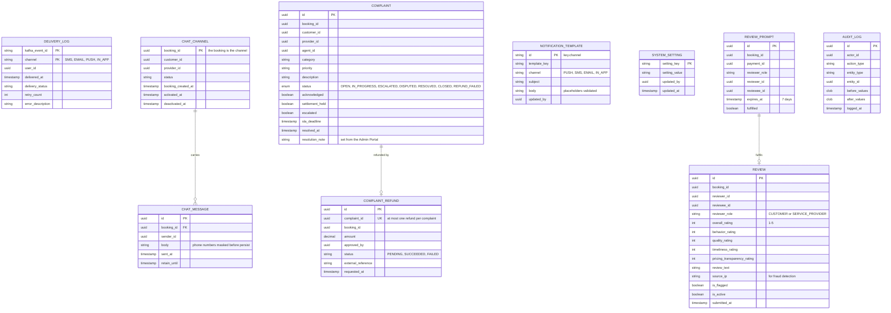
```mermaid
erDiagram
    DELIVERY_LOG {
        string kafka_event_id PK
        string channel PK "SMS, EMAIL, PUSH, IN_APP"
        uuid user_id
        timestamp delivered_at
        string delivery_status
        int retry_count
        string error_description
    }
    CHAT_CHANNEL {
        uuid booking_id PK "the booking is the channel"
        uuid customer_id
        uuid provider_id
        string status
        timestamp booking_created_at
        timestamp activated_at
        timestamp deactivated_at
    }
    CHAT_MESSAGE {
        uuid id PK
        uuid booking_id FK
        uuid sender_id
        string body "phone numbers masked before persist"
        timestamp sent_at
        timestamp retain_until
    }
    COMPLAINT {
        uuid id PK
        uuid booking_id
        uuid customer_id
        uuid provider_id
        uuid agent_id
        string category
        string priority
        string description
        enum status "OPEN, IN_PROGRESS, ESCALATED, DISPUTED, RESOLVED, CLOSED, REFUND_FAILED"
        boolean acknowledged
        boolean settlement_held
        boolean escalated
        timestamp sla_deadline
        timestamp resolved_at
        string resolution_note "set from the Admin Portal"
    }
    COMPLAINT_REFUND {
        uuid id PK
        uuid complaint_id UK "at most one refund per complaint"
        uuid booking_id
        decimal amount
        uuid approved_by
        string status "PENDING, SUCCEEDED, FAILED"
        string external_reference
        timestamp requested_at
    }
    NOTIFICATION_TEMPLATE {
        string id PK "key.channel"
        string template_key
        string channel "PUSH, SMS, EMAIL, IN_APP"
        string subject
        string body "placeholders validated"
        uuid updated_by
    }
    SYSTEM_SETTING {
        string setting_key PK
        string setting_value
        uuid updated_by
        timestamp updated_at
    }
    REVIEW {
        uuid id PK
        uuid booking_id
        uuid reviewer_id
        uuid reviewee_id
        string reviewer_role "CUSTOMER or SERVICE_PROVIDER"
        int overall_rating "1-5"
        int behavior_rating
        int quality_rating
        int timeliness_rating
        int pricing_transparency_rating
        string review_text
        string source_ip "for fraud detection"
        boolean is_flagged
        boolean is_active
        timestamp submitted_at
    }
    REVIEW_PROMPT {
        uuid id PK
        uuid booking_id
        uuid payment_id
        string reviewer_role
        uuid reviewer_id
        uuid reviewee_id
        timestamp expires_at "7 days"
        boolean fulfilled
    }
    AUDIT_LOG {
        uuid id PK
        uuid actor_id
        string action_type
        string entity_type
        uuid entity_id
        clob before_values
        clob after_values
        timestamp logged_at
    }

    CHAT_CHANNEL ||--o{ CHAT_MESSAGE : carries
    COMPLAINT ||--o| COMPLAINT_REFUND : "refunded by"
    REVIEW_PROMPT ||--o| REVIEW : fulfils
```

Reviews are two-way and carry five separate rating dimensions, with `overall_rating` driving the provider aggregate. `delivery_log` dedupes on the composite of Kafka event id and channel. `chat_channel` is keyed directly by booking id rather than a surrogate.

`review` has no unique constraint on the booking and reviewer pair, so the duplicate guard is a check-then-insert race. Chat messages store `retain_until` but no purge job exists. Both admin-service and rating-review-service define an `audit_log` table, with different columns, in their own schemas. `notification_template` (notification schema) replaced the hard-coded texts and is edited from the Admin Portal; `system_setting` (admin schema) persists System Configuration.

---

## 8. State machines

### 8.1 Booking

Nineteen states with the transition table encoded in `BookingStateMachine`. This diagram is the table verbatim, nothing added. `AWAITING_ASSIGNMENT` and its edges were added for Tenant fallback (section 5.8).

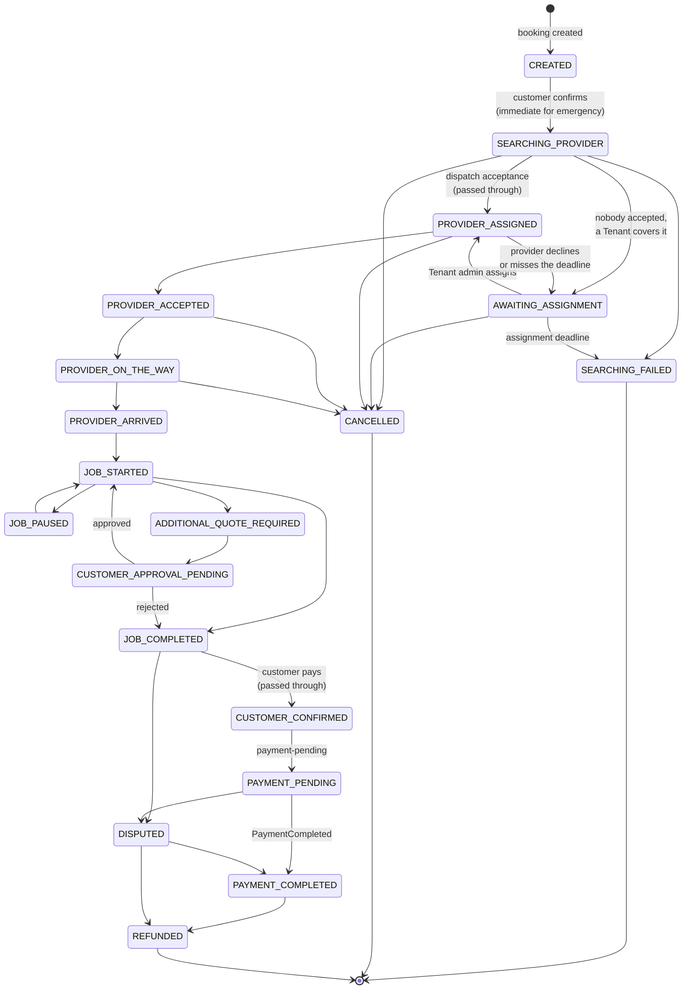
```mermaid
stateDiagram-v2
    [*] --> CREATED: booking created
    CREATED --> SEARCHING_PROVIDER: customer confirms<br/>(immediate for emergency)
    SEARCHING_PROVIDER --> PROVIDER_ASSIGNED: dispatch acceptance<br/>(passed through)
    SEARCHING_PROVIDER --> SEARCHING_FAILED
    SEARCHING_PROVIDER --> CANCELLED
    SEARCHING_PROVIDER --> AWAITING_ASSIGNMENT: nobody accepted,<br/>a Tenant covers it
    AWAITING_ASSIGNMENT --> PROVIDER_ASSIGNED: Tenant admin assigns
    AWAITING_ASSIGNMENT --> SEARCHING_FAILED: assignment deadline
    AWAITING_ASSIGNMENT --> CANCELLED
    PROVIDER_ASSIGNED --> PROVIDER_ACCEPTED
    PROVIDER_ASSIGNED --> AWAITING_ASSIGNMENT: provider declines<br/>or misses the deadline
    PROVIDER_ASSIGNED --> CANCELLED
    PROVIDER_ACCEPTED --> PROVIDER_ON_THE_WAY
    PROVIDER_ACCEPTED --> CANCELLED
    PROVIDER_ON_THE_WAY --> PROVIDER_ARRIVED
    PROVIDER_ON_THE_WAY --> CANCELLED
    PROVIDER_ARRIVED --> JOB_STARTED
    JOB_STARTED --> JOB_PAUSED
    JOB_STARTED --> ADDITIONAL_QUOTE_REQUIRED
    JOB_STARTED --> JOB_COMPLETED
    JOB_PAUSED --> JOB_STARTED
    ADDITIONAL_QUOTE_REQUIRED --> CUSTOMER_APPROVAL_PENDING
    CUSTOMER_APPROVAL_PENDING --> JOB_STARTED: approved
    CUSTOMER_APPROVAL_PENDING --> JOB_COMPLETED: rejected
    JOB_COMPLETED --> CUSTOMER_CONFIRMED: customer pays<br/>(passed through)
    JOB_COMPLETED --> DISPUTED
    CUSTOMER_CONFIRMED --> PAYMENT_PENDING: payment-pending
    PAYMENT_PENDING --> PAYMENT_COMPLETED: PaymentCompleted
    PAYMENT_PENDING --> DISPUTED
    PAYMENT_COMPLETED --> REFUNDED
    DISPUTED --> PAYMENT_COMPLETED
    DISPUTED --> REFUNDED
    SEARCHING_FAILED --> [*]
    CANCELLED --> [*]
    REFUNDED --> [*]
```

A scheduled booking lands in `CREATED` and needs an explicit confirmation call. An emergency booking is created and driven to `SEARCHING_PROVIDER` in the same request, as a saga whose compensation reverts to `CREATED`.

"Passed through" states are entered and left in one transaction: audited, but no event is published for them. Dispatch's acceptance walks `SEARCHING_PROVIDER → PROVIDER_ASSIGNED → PROVIDER_ACCEPTED` this way, so `PROVIDER_ASSIGNED` is a resting state only for a Tenant assignment awaiting the provider's answer. Paying is the customer's confirmation: payment-service's `payment-pending` call walks `JOB_COMPLETED → CUSTOMER_CONFIRMED → PAYMENT_PENDING`, and the `PaymentCompleted` consumer moves it on to `PAYMENT_COMPLETED` (passing through any state the pending call did not record). The Tenant assignment deadline fails an unanswered `PROVIDER_ASSIGNED` via `AWAITING_ASSIGNMENT → SEARCHING_FAILED` in one transaction.

Cancellation is legal from `SEARCHING_PROVIDER`, `AWAITING_ASSIGNMENT`, `PROVIDER_ASSIGNED`, `PROVIDER_ACCEPTED` and `PROVIDER_ON_THE_WAY`. It is not legal from `CREATED`, so a scheduled booking that was never confirmed cannot be cancelled, and the cancellation fee policy still computes fees for `PROVIDER_ARRIVED` and `JOB_STARTED`, so those calls compute a fee and then fail with 409. Only `SEARCHING_FAILED`, `CANCELLED` and `REFUNDED` are terminal, so a normally completed booking rests in `PAYMENT_COMPLETED`. See review section 8.3.

### 8.2 Payment transaction

```mermaid
stateDiagram-v2
    [*] --> PENDING: attempt n committed before the charge
    PENDING --> SUCCESS: signed callback SUCCEEDED
    PENDING --> FAILED: signed callback FAILED,<br/>gateway refuses, or 3rd customer retry
    SUCCESS --> PARTIALLY_REFUNDED: partial refund
    SUCCESS --> REFUNDED: full refund
    FAILED --> [*]: next request opens attempt n+1 (max 10)
    REFUNDED --> [*]
    PARTIALLY_REFUNDED --> [*]
```

`TransactionStatus.canTransitionTo` is the single source of truth, and the entity refuses illegal transitions. A transaction is one attempt: attempts for a booking share the customer + booking idempotency key, suffixed `:attempt:n` from the second, and a new one opens only when the latest is FAILED. A gateway error during the charge leaves the attempt PENDING (outcome unknown) for the callback to settle. `PARTIALLY_REFUNDED` has no outgoing transition, so a second refund of a partially refunded payment is refused (409), although `PaymentService.refund` lists it as refundable. Refunds themselves are `payment_refund` rows (PENDING, SUCCEEDED, FAILED); a refund whose gateway outcome is unknown stays PENDING until a same-key retry or a finance reconcile.

### 8.3 Settlement

```mermaid
stateDiagram-v2
    [*] --> PENDING: requested
    PENDING --> COMPLETED: transfer succeeds
    PENDING --> FAILED: transfer fails
    COMPLETED --> [*]
    FAILED --> [*]
```

### 8.4 Complaint

```mermaid
stateDiagram-v2
    [*] --> OPEN
    OPEN --> IN_PROGRESS
    IN_PROGRESS --> RESOLVED
    IN_PROGRESS --> ESCALATED: SLA breached
    OPEN --> ESCALATED: SLA breached
    ESCALATED --> RESOLVED
    RESOLVED --> CLOSED
    RESOLVED --> REFUND_FAILED
    OPEN --> DISPUTED: dispute, provider<br/>settlement held
    CLOSED --> [*]
```

These are the statuses the service uses, but no transition table is encoded, so any non-terminal status can be set from any other. The Admin Portal's update refuses the system-only states (`ESCALATED`, `REFUND_FAILED`), which only the SLA sweep and a rejected refund may set. See review sections 8.5 and 17.3.

### 8.5 Outbox event

```mermaid
stateDiagram-v2
    [*] --> PENDING: written in domain transaction
    PENDING --> PUBLISHED: Kafka ack
    PENDING --> PENDING: failed attempt, next_attempt_at = now + backoff 1s→60s
    PENDING --> FAILED: 10 attempts exhausted
    PUBLISHED --> [*]
    FAILED --> [*]: manual replay
```

---

## 9. Dispatch matching algorithm

```mermaid
flowchart TD
    A["BookingCreated consumed"] --> A1["Resolve address coordinates<br/>and subcategory skill tags"]
    A1 --> B["Pick bulkhead pool<br/>emergency or scheduled"]
    B --> C["Fetch eligible providers<br/>within radius"]
    C --> D{"Any candidates?"}
    D -->|no| E["Expand radius by step"]
    E --> F{"Max radius reached?"}
    F -->|no| C
    F -->|yes| G["POST searching-failed:<br/>Tenant fallback or SEARCHING_FAILED"]
    D -->|yes| H["Score each candidate"]

    H --> H1["distance weight"]
    H --> H2["rating weight"]
    H --> H3["acceptance rate weight"]
    H --> H4["idle time weight"]
    H1 & H2 & H3 & H4 --> I["Rank descending"]

    I --> J["Next candidate"]
    J --> K["Acquire Redis lock<br/>SET NX PX per provider"]
    K --> L{"Lock acquired?"}
    L -->|"no: busy with another offer"| BUSY["Keep in pool; retry after the<br/>free candidates, up to one offer window"]
    BUSY --> J
    L -->|yes| M["Offer in Redis, poll for the<br/>provider's answer (60 s window)"]
    M --> N{"Accepted?"}
    N -->|no| O["Release lock, ProviderRejected,<br/>drop from pool"]
    O --> J
    J -->|"pool exhausted"| E
    N -->|yes| P["POST provider-accepted<br/>→ PROVIDER_ACCEPTED"]
    P --> Q["Publish ProviderAccepted"]
```

Weights are validated with `BigDecimal` and must sum to one. They are stored in a process-local map, so admin changes (Admin Portal, Dispatch module) apply at runtime but are lost on restart and differ between replicas. Before every offer the search checks whether a `BookingCancelled` has arrived, and a 409 or 404 from booking-service ends the run quietly.

---

## 10. Deployment

### 10.1 Local (Docker Compose)

```mermaid
graph TB
    subgraph Host["Developer machine (Windows)"]
        PG[("PostgreSQL 18<br/>Windows service, :5432")]
        RD[("Redis-compatible :6379<br/>Memurai, or a redis container")]
        KF[["Kafka 4.1 KRaft, C:\kafka<br/>:9092 host, :9094 containers<br/>started by hand"]]
        subgraph net["Docker Compose: docker-compose.core.yml"]
            S["20 service containers<br/>8080 – 8099, mem_limit 448m each"]
            W["3 nginx SPA containers<br/>5173, 5174, 5175"]
        end
        SMS["docker/dev-sms/dev-sms.log<br/>bind mount, OTP sink"]
    end

    W --> S
    S -->|host.docker.internal| PG & RD & KF
    S --> SMS
```

Postgres, Kafka and Redis are the ones installed on the machine, reached from the containers through `host.docker.internal` (override with `HOMEFIX_DB_HOST`, `HOMEFIX_REDIS_HOST`, `HOMEFIX_KAFKA_BOOTSTRAP_SERVERS`; `docker-compose.infra.yml` runs them as containers instead). Kafka does not start on its own after a reboot, and on native Windows it runs with retention and the log cleaner off because it cannot delete segments. Setup is in [LOCAL_ACCESS.md](LOCAL_ACCESS.md) section 1.

Each service container has a `wget` readiness healthcheck with a 300 s start period and a bounded `on-failure` restart policy. Images are runtime-only: the fat jar must already exist under each service's `target/`. Every Java service has `mem_limit: 448m` and a `JAVA_TOOL_OPTIONS` heap percentage, because twenty unbounded JVMs exhaust the WSL VM.

Settings that differ from the code defaults locally:

| Variable | Service | Local value | Why |
| --- | --- | --- | --- |
| `PAYMENT_SIMULATOR_ENABLED`, `PAYMENT_DEFAULT_GATEWAY` | payment-service | `true`, `simulator` | settles payments through the signed-callback path without a real gateway; **local only**, never set in Helm |
| `PROVIDER_WALLET_CLIENT` | payment-service | `http` | credits provider-service's wallet (code default `logging` pays no one); Helm also sets `http` |
| `TENANT_ASSIGNMENT_TIMEOUT` | booking-service | `PT60M` | how long a booking may wait for a Tenant assignment; same in Helm |
| `KAFKA_BOOTSTRAP_SERVERS` | booking-service and the other consumers | `host.docker.internal:9094` | booking-service now consumes `PaymentCompleted` |
| `INTERNAL_API_KEY` | every service with `/internal/**` callers or endpoints | from `.env` | shared service credential |
| `DEV_SEED_ENABLED`, `DEV_SEED_PASSWORD` | auth-service | from `.env` (`true`, `HomeFix@2026`) | seeds the test accounts; Compose's own default is off |

### 10.2 AWS target (Terraform)

```mermaid
graph TB
    U["Users"] --> CF["CloudFront / WAF"]
    CF --> APIGW["API Gateway v2<br/>JWT authorizer"]
    APIGW --> ALB["Ingress"]

    subgraph VPC["VPC, 3 tiers, ap-south-1"]
        subgraph Public
            NAT["NAT gateways"]
        end
        subgraph PrivateApp
            ALB --> EKS["EKS 1.29<br/>IRSA, KMS secret encryption"]
        end
        subgraph PrivateData
            RDS[("RDS PostgreSQL 15.5<br/>Multi-AZ, encrypted")]
            MSK[["MSK<br/>TLS + SASL/SCRAM"]]
            EC[("ElastiCache Redis<br/>encrypted, auth token")]
        end
    end

    EKS --> RDS & MSK & EC
    EKS --> S3[("S3 + KMS<br/>media, invoices")]
    EKS --> SM["Secrets Manager"]
    EKS --> PROM["Prometheus / Grafana"]
    EKS --> FB["Fluent Bit → CloudWatch"]
```

Terraform is the most complete infrastructure layer. Database migrations now exist (section 7), so the largest gap that blocks a real deploy is the namespace mismatch in 10.3. The pipeline builds, tests and images every service and can deploy them with the chart, but only once infrastructure the repository does not create exists (ECR repositories, a GitHub OIDC role, per-service Kubernetes Secrets); the header of `.github/workflows/cd-production.yml` lists it.

### 10.3 Namespace and chart layout

All services share one Helm chart, `helm/homefix-service`, with one release per service (`homefix-<service>`) rendered from `values-<environment>.yaml` plus `helm/services/<service>.yaml`. Resources are named after the bare service, so in-cluster DNS matches Compose (`auth-service:8081`). The pipeline deploys into the namespace configured on each GitHub environment, while the Kubernetes manifests under `infra/k8s` still assume six domain namespaces. Reconciling these is step 12 of the roadmap.

---

## 11. Cross-cutting concerns

```mermaid
graph LR
    subgraph "Every request"
        A["X-Correlation-ID<br/>generated at gateway"] --> B["MDC in every service"]
        B --> C["Structured JSON logs<br/>PII masked"]
        B --> D["OpenTelemetry span attrs"]
    end
    subgraph "Every service"
        E["/health/liveness"]
        F["/health/readiness"]
        G["/prometheus"]
        H["/metrics"]
    end
```

Actuator endpoints are exposed at the root path, not under `/actuator`; the Helm chart probes `/health/liveness` and `/health/readiness` on each service's own port. They are also unauthenticated.

Resilience is meant to wrap every synchronous call through the shared `ResilientCall` helper: per-call timeout, three retries with exponential backoff, then a circuit breaker that opens at 50 percent failures over a 10-call window for 30 seconds. In practice only booking-service and dispatch-engine use it, and most other outbound clients have no timeout at all.

---

## 12. Reading order for newcomers

1. This document, then `.kiro/specs/homefix-platform/requirements.md` for the product rules.
2. [LOCAL_ACCESS.md](LOCAL_ACCESS.md) to get the stack running and log in as each role.
3. [API_CONTRACTS.md](API_CONTRACTS.md) when wiring a client or a new service.
4. `shared/homefix-shared-security` and `shared/homefix-shared-outbox`, which every service depends on.
5. `services/booking-service`, the richest domain model and the best example of the intended patterns.
6. [../CODEBASE_REVIEW.md](../CODEBASE_REVIEW.md) before trusting any integration to work end to end.
